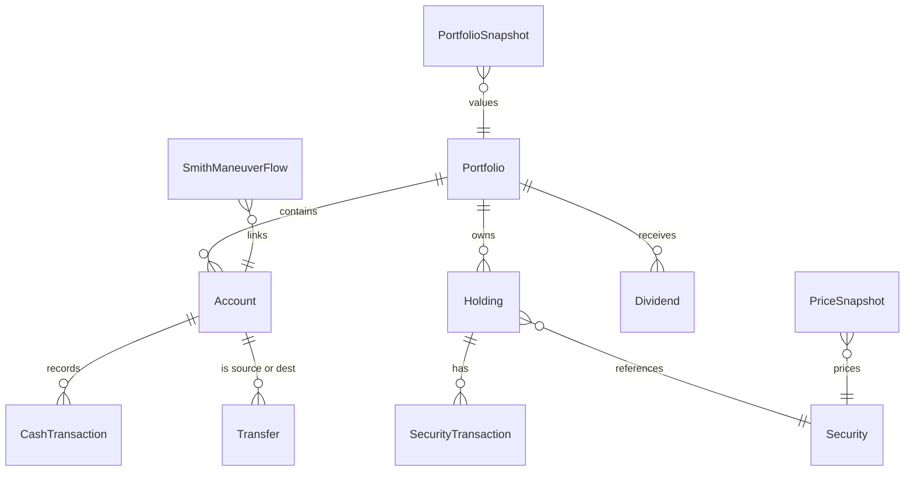

# Investment Tracker — Requirements

Version: 0.1 (draft)
Status: Requirements gathering. No application code in this phase.
Audience: Single user (the owner), running locally.

This document specifies the requirements for a personal Canadian investment and Smith Maneuver tracker. It is the canonical reference for what the application should do. It deliberately stays technology-agnostic except where a choice materially affects requirements; the implementation stack is decided in a later phase.

---

## 1. Vision and Goals

The Investment Tracker is a personal, local-first application for tracking investments across multiple portfolios, including portfolios funded through the Smith Maneuver.

Primary goals:

- Track one or more portfolios, each with its own accounts, holdings, dividends, and money flows.
- Replace ad-hoc spreadsheet tracking with structured, queryable data and a clear dashboard.
- Maintain an accurate Adjusted Cost Base (ACB) per security so capital gains and losses can be reported correctly at tax time.
- Trace the flow of borrowed money (HELOC) into investments to support the interest-deductibility record-keeping that the Smith Maneuver depends on.
- Present per-portfolio analytics (allocation, returns over multiple periods, dividend history) in a dashboard.

Non-goals for the first version are listed in Section 2.

---

## 2. Scope

### 2.1 In Scope (V1)

- Local web application, single user, running on `localhost`.
- Mostly manual data entry for transactions, dividends, transfers, and prices.
- Multiple portfolios with accounts, holdings, dividends, and money-flow transactions.
- ACB tracking and Canadian capital-gains reporting support.
- Smith Maneuver money-flow tracing, HELOC interest logging, and deductible-interest estimation.
- A per-portfolio dashboard modeled on the reference design (Section 5).
- CSV/JSON export of transactions and tax summaries.

### 2.2 Out of Scope (V1)

These are explicitly deferred to later phases:

- Broker/API integrations and automated CSV import from brokerages.
- Multi-user accounts, authentication, and cloud hosting.
- Real-time or delayed market data feeds (prices are entered manually in V1).
- Automated tax filing or generation of official CRA forms.
- Native mobile applications.
- Migration/import from the existing `acb-tracker` Excel workbook (noted as a future option in Section 9).
- Multi-currency conversion and FX gain/loss handling.

---

## 3. Core Domain Model

### 3.1 Entity relationships

### 3.2 Portfolio

Represents a logical grouping of accounts and holdings.

- Name (required, unique).
- Description (optional).
- Base currency (default `CAD`).
- Type tag (optional): `Taxable`, `TFSA`, `RRSP`, `Smith Maneuver`, `Other`. The tag is informational in V1 and may drive future registered-account rules.
- Derived: total market value, total cost basis, total return (from holdings and snapshots).

### 3.3 Account

A money container within a portfolio. Accounts hold cash and/or securities and record the movement of money.

- Account type: `Chequing`, `Investment (cash)`, `Margin`, `HELOC`, `Other`.
- Institution / display label (e.g., "TD HELOC", "Questrade Margin").
- Currency (default `CAD`).
- Opening balance and opening balance date.
- Current balance: derived from opening balance plus all cash transactions and transfer legs.
- For `HELOC` accounts: credit limit (optional), interest rate (see Section 6 / Smith Maneuver).

### 3.4 Security

A tradable instrument referenced by holdings.

- Ticker symbol, including exchange prefix where relevant (e.g., `TSE:XEI`, `TSE:BANK`).
- Display name (e.g., "iShares Canadian Select Dividend").
- Asset class (optional): `Equity`, `ETF`, `Fixed Income`, `Cash`, `Other`.
- Currency (default `CAD`).

### 3.5 Holding

A position in a security within a portfolio.

- References one Portfolio and one Security.
- Derived quantity (share balance), total ACB, and ACB/share computed from its security transactions (Section 6).
- Latest manual market price or market value used for dashboard metrics (V1 has no live quotes).

### 3.6 Security transaction

Records a trade or distribution that affects a holding's quantity and/or ACB. The action set and field semantics intentionally mirror the existing `acb-tracker` workbook so that the V1 model is a known, validated calculation (see Section 6).

Input fields:

- Date.
- Security.
- Action: one of `Buy`, `Sell`, `Return of Capital`, `Reinvested Distribution`, `Split`.
- Shares (for `Buy`, `Sell`).
- Price per share (for `Buy`, `Sell`).
- Commission (for `Buy`, `Sell`).
- Cash amount (for `Return of Capital`, `Reinvested Distribution`).
- Split ratio (for `Split`, e.g., `2` for 2:1, `1.5` for 3:2).
- Notes (free text, retained for audit trail).

Computed fields (see Section 6 for formulas):

- Share change and running share balance.
- ACB change, denied loss adjustment, total ACB, ACB/share.
- Proceeds (on `Sell`).
- Capital gain/loss (on `Sell`).
- Superficial loss flag.

### 3.7 Cash / money-flow transaction

Records movement of cash within or between accounts. Distinct from security transactions, though a buy will typically have a corresponding cash outflow in an investment account.

- Date.
- Account.
- Type: `Deposit`, `Withdrawal`, `Transfer`, `HELOC Draw`, `HELOC Repayment`, `Interest Charge`, `Interest Payment`, `Fee`.
- Amount.
- Counterparty account (for `Transfer`, and for HELOC draw/repayment legs).
- Purpose tag: `Investment` or `Personal` (critical for Smith Maneuver deductibility tracing).
- Linked transaction reference(s): allows chaining related legs (e.g., HELOC draw -> chequing deposit -> investment deposit -> buy).
- Notes.

### 3.8 Transfer

A transfer is a paired cash transaction with a source account and a destination account. The application records it as a single logical transfer that produces two balanced legs (double-entry), so that the sum of all account movements remains consistent.

### 3.9 Dividend

Records dividend or distribution income received.

- Date (payment date; record date optional).
- Security.
- Portfolio (and optionally the receiving account).
- Gross amount.
- Withholding tax (optional, e.g., foreign withholding).
- Net amount (derived: gross minus withholding).
- Currency (default `CAD`).
- DRIP flag (optional): when set, the dividend is reinvested and should be linked to a corresponding `Buy` or `Reinvested Distribution` security transaction.

### 3.10 Smith Maneuver flow

A traceable link describing how borrowed funds moved from a HELOC into investments. See Section 6.4 for the rules.

- Source HELOC account.
- Ordered chain of linked cash transactions (draw -> intermediate transfers -> investment deposit -> optional buy).
- Investment-use amount (the portion of the draw deemed used for income-producing investment).
- Status: `Traced`, `Partially traced`, `Untraced`.

### 3.11 Price snapshot and portfolio snapshot

Because V1 has no live quotes, return calculations rely on stored values the user records periodically.

- Price snapshot: security, date, price per share.
- Portfolio snapshot: portfolio, date, total market value (can be derived from price snapshots or entered directly).

These snapshots are the basis for the dashboard's period-return widgets (Section 5).

---

## 4. Functional Requirements

| Area                 | V1 requirements                                                                                                                                                                                           |
| -------------------- | --------------------------------------------------------------------------------------------------------------------------------------------------------------------------------------------------------- |
| Portfolio management | Create, read, update, delete (CRUD) portfolios. Switch the active portfolio context for the dashboard and reports.                                                                                        |
| Account management   | CRUD accounts within a portfolio. View running balance derived from opening balance plus cash transactions and transfer legs.                                                                             |
| Holdings             | View current positions per portfolio (and optionally per account). Drill into a holding's full security-transaction history.                                                                              |
| Trade entry          | Manually enter security transactions with per-action validation (e.g., `Buy`/`Sell` require shares and price; `Return of Capital`/`Reinvested Distribution` require cash amount; `Split` requires ratio). |
| Dividends            | Record dividends with gross, withholding, and net. Optionally mark as DRIP and link the reinvestment. Dividends feed the monthly dividend report and chart.                                               |
| Transfers            | Record inter-account transfers as balanced double-entry legs. Tag purpose as `Investment` or `Personal`.                                                                                                  |
| Cash transactions    | Record deposits, withdrawals, fees, HELOC draws/repayments, and interest charges/payments.                                                                                                                |
| Smith Maneuver       | Build and view the borrow-to-invest flow chain; log HELOC interest; estimate the deductible portion of interest from the traced investment-use balance. Warn on untraced or mixed-use funds.              |
| ACB / tax            | Maintain running ACB per security; compute realized gains/losses on sells; flag possible superficial losses; allow manual denied-loss adjustments; produce a tax-year summary and export.                 |
| Prices and snapshots | Enter per-security prices and/or portfolio market-value snapshots used by dashboard returns.                                                                                                              |
| Dashboard            | Present per-portfolio widgets matching the reference design (Section 5).                                                                                                                                  |
| Data export          | Export transactions, dividends, and tax summaries to CSV and/or JSON.                                                                                                                                     |
| Data integrity       | Validate inputs; keep an audit trail of edits/deletes (Section 7).                                                                                                                                        |

### 4.1 Validation rules (selected)

- A `Sell` cannot reduce a holding's share balance below zero; warn or block.
- A `Buy`/`Sell` requires shares > 0 and price >= 0.
- `Return of Capital` and `Reinvested Distribution` require a cash amount and no shares/price.
- `Split` requires a ratio > 0.
- A transfer requires distinct source and destination accounts and a positive amount.
- Dates are stored in ISO `YYYY-MM-DD`.

### 4.2 Holdings screen — first implementation slice

The Holdings screen is built before Portfolio management exists. The following interim rules apply until portfolio scoping lands (see Section 9):

- **Global aggregation:** Holdings and ACB are computed across all security transactions in the database (single implicit book). Portfolio-scoped holdings and an active-portfolio switcher are deferred to a later slice.
- **Zero balance:** Securities with a share balance of zero are hidden from the holdings list (fully disposed positions are not shown).
- **Manual prices:** Users enter prices via a batch update (one request with an array of security/price entries). The UI shows each price **as of** its snapshot date (e.g. in table or card footnotes).
- **Cash row:** The Holdings mock includes a cash line (e.g. margin account balance). The first slice shows a **coming soon** placeholder in the UI until cash transactions and derived account balances are implemented (see Section 9).

---

## 5. Dashboard Requirements

The per-portfolio dashboard mirrors the reference design. All values are scoped to the active portfolio.

1. Allocation donut chart — current holdings by ticker, each as a percentage of the portfolio's total market value (e.g., `TSE:XEI 47.8%`, `TSE:BANK 31.6%`). Uses latest manual prices.
2. Today's return — dollar and percentage change of the portfolio's market value versus the most recent prior snapshot. Displayed with sign and color (gain/loss).
3. All-time return — total gain/loss since the first transaction: current market value plus realized gains and dividends, compared against net invested cost basis. Shown as dollar amount and percentage.
4. Dividends chart — monthly bars for a selected calendar year showing total dividends received per month, with a cumulative line overlay.
5. Period-return cards — `5 Days`, `One Month`, `Six Month`, and `One Year` returns, each as a dollar amount and percentage, computed from stored portfolio snapshots nearest the relevant past date.

### 5.1 V1 data dependency (manual)

The return widgets (Today's, period cards, all-time) depend on the user periodically recording portfolio snapshots or per-security prices. The application computes returns from the nearest available stored snapshot to each target date; it does not fetch live or historical market data in V1. Where a snapshot is missing for a target date, the widget should indicate that data is unavailable rather than display a misleading value.

---

## 6. ACB and Canadian Tax Requirements

V1 carries forward the calculation model already proven in the existing `acb-tracker` workbook (`[/Users/felipelo/acb-tracker/build_acb_tracker.py](/Users/felipelo/acb-tracker/build_acb_tracker.py)`), then structures it into application logic. Transactions for a security must be processed in date order to produce correct running balances.

### 6.1 Transaction model (carried forward from acb-tracker)

The five actions and their effects:

| Action                            | Share effect            | ACB effect                        | Notes                                                                          |
| --------------------------------- | ----------------------- | --------------------------------- | ------------------------------------------------------------------------------ |
| Buy                               | + shares                | + (shares x price + commission)   | Increases total ACB and share balance.                                         |
| Sell                              | - shares                | - (shares sold x prior ACB/share) | Generates proceeds and a realized gain/loss; does not change ACB/share.        |
| Return of Capital (ROC)           | none                    | - cash amount                     | Reduces total ACB without changing shares.                                     |
| Reinvested Distribution (phantom) | none                    | + cash amount                     | Increases total ACB without changing shares (reinvested/phantom distribution). |
| Split                             | adjusts shares by ratio | none                              | Total ACB unchanged; ACB/share changes because share count changes.            |

### 6.2 Derived values

For each security, processed in date order:

- Share balance: running sum of share changes.
- Total ACB: running sum of ACB changes, plus denied-loss add-backs, floored at zero.
- ACB/share: total ACB / share balance (zero when no shares).
- Proceeds (on sell): shares sold x price - commission.
- Capital gain/loss (on sell): proceeds - (shares sold x prior ACB/share).
- Realized gains can be grouped by tax year.

### 6.3 Superficial loss handling

- Flag any `Sell` at a loss when a `Buy` of the same security occurs within the ±30-day window around the sell date (the CRA superficial loss window), prompting the user to review.
- Provide a manual denied-loss adjustment field; the denied amount is added back to the holding's ACB and the loss is disallowed for that disposition.
- Keep notes for the audit trail.

These mirror the workbook's `Superficial Loss Flag` and `Denied Loss Adj` columns and the COUNTIFS-based ±30-day detection.

### 6.4 Smith Maneuver: money-flow tracing and deductible interest

The Smith Maneuver borrows against home equity (HELOC) to invest in income-producing assets, making the loan interest potentially tax-deductible. Deductibility depends on tracing borrowed funds to eligible investment use. V1 supports:

- Money-flow tracing: link a `HELOC Draw` through any intermediate `Transfer` legs to an investment-account deposit and, ideally, to the resulting `Buy`. Each leg carries the `Investment` vs `Personal` purpose tag.
- Investment-use balance: the running total of HELOC principal traced to investment purposes. Draws tagged `Personal` or left untraced do not count toward the deductible base.
- HELOC interest log: record `Interest Charge`/`Interest Payment` entries on the HELOC account, with the period and amount.
- Deductible-interest estimate: for a given interest entry, estimate the deductible portion as the share of the HELOC balance attributable to traced investment use during that period.
- Warnings: surface when funds are `Untraced` or when an account mixes investment and personal balances in a way that weakens the deductibility assumption, since commingling complicates tracing.

Document clearly that this is a record-keeping and estimation aid, not tax advice.

### 6.5 Granularity

ACB is computed per security per portfolio (not globally), since different portfolios are reported and managed separately. Account-level breakdowns may be offered for reporting where useful, but the canonical ACB unit is the holding (portfolio + security).

### 6.6 Tax-year reporting

- Realized capital gains/losses by security and in total for a selected tax year.
- Dividend income summary for the year (gross, withholding, net).
- Smith Maneuver deductible-interest summary for the year.
- Export to CSV/JSON for use in tax preparation.

### 6.7 Disclaimer

The application is a calculator and record-keeping tool, not tax advice. Users should confirm figures against CRA rules and their own circumstances.

---

## 7. Non-Functional Requirements

- Local web app: runs on `localhost`, single user, no login required in V1.
- Data persistence: a local database. SQLite is proposed for simplicity and portability; the final choice is deferred to the implementation phase.
- Privacy: all data stays on the user's machine; no external telemetry or third-party data sharing.
- Auditability: the transaction log should be effectively immutable — edits and deletes should preserve history (via audit entries or soft-delete with prior versions) so tax figures remain reproducible.
- Currency: `CAD` is the primary currency. FX conversion and multi-currency gain/loss are out of scope for V1.
- Determinism: given the same inputs, ACB and tax computations must produce identical results across runs.
- Backups: data should be easy to back up and restore (e.g., a single database file or an export/import path).

---

## 8. Suggested V1 User Workflows

### 8.1 Set up a taxable portfolio

1. Create a portfolio (type `Taxable`).
2. Add an investment (cash) account.
3. Record `Buy` transactions for securities.
4. Enter manual per-security prices (or a portfolio snapshot).
5. Open the dashboard to view allocation and returns.

### 8.2 Record a dividend

1. Open the portfolio and choose "Record dividend".
2. Enter date, security, gross amount, and any withholding.
3. Optionally mark as DRIP and link the reinvestment (`Buy` or `Reinvested Distribution`).
4. Confirm the dividend appears on the monthly dividends chart and the tax-year dividend summary.

### 8.3 Smith Maneuver cycle

1. Record a `HELOC Draw` on the HELOC account, tagged `Investment`.
2. Transfer the funds to chequing, then to the investment account (linked legs).
3. Record the `Buy` of the income-producing asset.
4. Each month, log the HELOC `Interest Charge`/`Interest Payment`.
5. View the deductible-interest estimate based on the traced investment-use balance.
6. At year-end, export the deductible-interest summary for tax filing.

---

## 9. Open Questions and Future Phases

Deferred decisions that do not block V1:

- **Portfolio scoping:** The Portfolio entity, portfolio-scoped accounts and holdings, and the active-portfolio switcher on Dashboard and Holdings. The first Holdings slice uses global aggregation (Section 4.2); refactor queries and UI when Portfolio management is built.
- **Cash on Holdings:** Account cash balances and the Holdings cash row (market value from derived account balance, as in the mock). Until cash transactions and balance derivation exist, the UI shows a coming-soon stub only.
- Broker CSV import formats (e.g., Questrade, Wealthsimple, TD).
- A live or historical quote provider to automate returns instead of manual snapshots.
- Registered-account-specific rules (TFSA/RRSP contribution room and limits).
- Multi-currency securities and FX gain/loss.
- Importing existing data from the `acb-tracker` Excel workbook.
- Printable helper views aligned to T5008 / Schedule 3 and T3/T5 dividend reporting.
- Configurable superficial-loss handling across linked/affiliated accounts.

---

## 10. Glossary

- ACB (Adjusted Cost Base): the tax cost of a holding, used to compute capital gains/losses on disposition.
- ROC (Return of Capital): a distribution that is not income; it reduces ACB rather than being taxed immediately.
- Reinvested / phantom distribution: a distribution reinvested without cash changing hands (common with ETFs); it increases ACB.
- Superficial loss: a loss disallowed by the CRA when the same (or identical) property is bought within 30 days before or after a sale and still held; the denied loss is added to the ACB of the repurchased property.
- Smith Maneuver: a Canadian strategy of borrowing against home equity (HELOC) to invest in income-producing assets, potentially making the loan interest tax-deductible.
- DRIP (Dividend Reinvestment Plan): automatic reinvestment of dividends into additional shares.
- HELOC (Home Equity Line of Credit): a revolving credit line secured against home equity, used here as the borrowing source for the Smith Maneuver.
- Deductible interest: the portion of loan interest attributable to funds used to earn investment income, which may be tax-deductible.

---

## Appendix A — Implementation Notes (non-binding)

These notes are not requirements; they record likely directions to speed up the implementation phase without committing the design:

- A local web stack such as a single-page UI (e.g., React) backed by a small local API and a SQLite database would satisfy the local-first, single-user goals.
- The ACB engine should be a pure, deterministic module that takes ordered transactions and returns derived values, making it independently testable and consistent with the existing workbook formulas.
- Snapshots (prices/portfolio values) should be first-class records so return widgets remain correct and reproducible even as data grows.

