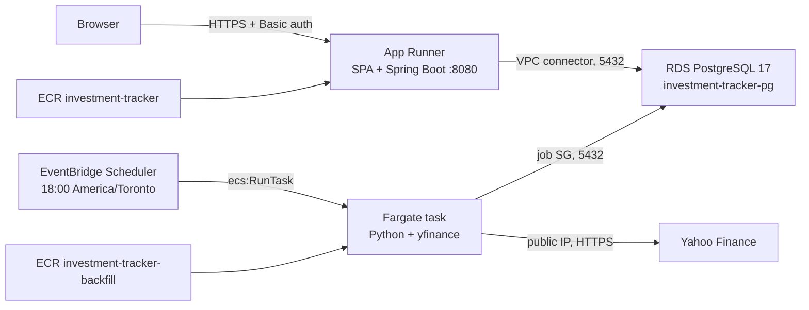

# Build and deploy artifacts (AWS)

Command cookbook for every artifact discussed while standing up this account: AWS CLI, cheapest RDS Postgres, the App Runner JVM image (SPA + API), and the nightly yfinance backfill image on Fargate.

Longer first-time walkthroughs still live in [AWS-DEPLOYMENT.md](AWS-DEPLOYMENT.md) (app + RDS) and [AWS-PRICE-BACKFILL.md](AWS-PRICE-BACKFILL.md) (EventBridge + Fargate). This file is the **artifact-by-artifact** version: what to build, what to push, what to create in AWS, and how to update it later.

**This account’s live region is `us-east-1`.** Stay there. The generic guides still show `ca-central-1` as an example; mixing regions leaves App Runner talking to an empty VPC while RDS sits in another.



There is **no separate frontend host**. The JVM image builds `frontend/` and serves it from the API. EventBridge **does not run Docker images**; it starts a Fargate task.

---

## Artifact map

| # | Artifact | Built from | Runs as | Writes / serves |
|---|----------|------------|---------|-----------------|
| 0 | AWS CLI on this Mac | Homebrew `awscli` | Laptop | Talks to the account |
| 1 | RDS PostgreSQL | Nothing in this repo | `investment-tracker-pg` (`db.t4g.micro`) | App data + `price_snapshot` |
| 2 | App image | [`backend/Dockerfile`](../backend/Dockerfile), **repo root** context | App Runner `investment-tracker` | HTTPS UI + `/api/v1` |
| 3 | Backfill image | [`scripts/Dockerfile`](../scripts/Dockerfile), **`scripts/`** context | Fargate task `investment-tracker-backfill` | Direct upserts into RDS (no Java API) |

Once those AWS pieces already exist, day-to-day rebuilds are versioned. Images are tagged `YYYY.MM.DD-<gitsha>` (immutable). There is no `:latest`.

```bash
# from the repository root — prompts for app, backfill, status, bootstrap, rollback
./scripts/update_aws.sh
./scripts/update_aws.sh app
./scripts/update_aws.sh status
./scripts/update_aws.sh rollback app --to 2026.09.18-a9e7974
```

If the services still point at `:latest` (the original create), run **`./scripts/update_aws.sh bootstrap` once** before the first versioned build. That copies the live digest to `YYYY.MM.DD-bootstrap`, pins App Runner and the Fargate task definition to it, then deletes `:latest`.

The script **only updates**. It will not create RDS, IAM, security groups, App Runner, or the EventBridge schedule. First-time create is still the sections below (or [AWS-DEPLOYMENT.md](AWS-DEPLOYMENT.md) / [AWS-PRICE-BACKFILL.md](AWS-PRICE-BACKFILL.md)). Rolling an image back does **not** roll Liquibase back; snapshot RDS before a deploy that includes changelog files.

Supporting AWS pieces (not container images): default VPC, two security groups into RDS (`investment-tracker-apprunner`, `investment-tracker-backfill`), App Runner VPC connector, ECR repos, IAM roles, ECS cluster, EventBridge schedule `investment-tracker-price-backfill`.

**Not used:** Aurora Serverless, NAT Gateway, S3/CloudFront for the SPA, putting Python inside the App Runner JVM image.

---

## Shared shell (start every session)

Docker Desktop must be running (`docker info`). Run everything in **one terminal** so the exports stick.

```bash
export AWS_REGION=us-east-1
export AWS_ACCOUNT_ID=$(aws sts get-caller-identity --query Account --output text)
export APP_NAME=investment-tracker
export DB_INSTANCE_ID=${APP_NAME}-pg
export DB_NAME=investment_tracker
export DB_USER=investment_tracker
# Same master password you set on RDS — do not paste it into chat or commit it:
export DB_PASSWORD='REPLACE_WITH_THE_SAME_RDS_PASSWORD'

export APP_AUTH_USERNAME=tracker
export APP_AUTH_PASSWORD='REPLACE_WITH_APP_PASSWORD'
export ALPHAVANTAGE_API_KEY=

export ECR_URI=${AWS_ACCOUNT_ID}.dkr.ecr.${AWS_REGION}.amazonaws.com/${APP_NAME}
export BACKFILL_ECR_URI=${AWS_ACCOUNT_ID}.dkr.ecr.${AWS_REGION}.amazonaws.com/${APP_NAME}-backfill
export VERSION="$(date +%Y.%m.%d)-$(git rev-parse --short=7 HEAD)"

export POSTGRES_HOST=$(aws rds describe-db-instances --region "$AWS_REGION" \
  --db-instance-identifier "$DB_INSTANCE_ID" \
  --query 'DBInstances[0].Endpoint.Address' --output text)

export VPC_ID=$(aws rds describe-db-instances --region "$AWS_REGION" \
  --db-instance-identifier "$DB_INSTANCE_ID" \
  --query 'DBInstances[0].DBSubnetGroup.VpcId' --output text)

export SUBNET_IDS=$(aws rds describe-db-instances --region "$AWS_REGION" \
  --db-instance-identifier "$DB_INSTANCE_ID" \
  --query 'join(`,`, DBInstances[0].DBSubnetGroup.Subnets[*].SubnetIdentifier)' \
  --output text)

export RDS_SG_ID=$(aws rds describe-db-instances --region "$AWS_REGION" \
  --db-instance-identifier "$DB_INSTANCE_ID" \
  --query 'DBInstances[0].VpcSecurityGroups[0].VpcSecurityGroupId' --output text)

echo "account=$AWS_ACCOUNT_ID region=$AWS_REGION"
echo "host=$POSTGRES_HOST"
echo "VPC_ID=$VPC_ID"
echo "SUBNET_IDS=$SUBNET_IDS"
echo "RDS_SG_ID=$RDS_SG_ID"
```

None of those should print `None`. If `POSTGRES_HOST` is `None`, the region is wrong.

On Apple Silicon, **every** image pushed to ECR must be `linux/amd64` (App Runner and Fargate are x86).

`EntityAlreadyExists` / `InvalidPermission.Duplicate` on a create means that piece is already there — skip create, keep going.

---

## 0. AWS CLI (laptop)

Needed before any other artifact.

### Install (macOS, Homebrew)

```bash
brew install awscli
aws --version    # expect aws-cli/2.x
```

### Credentials

1. IAM user in the console (not root) with enough access for VPC, RDS, ECR, App Runner, ECS, EventBridge, IAM.
2. **Security credentials → Create access key → Command Line Interface**.
3. Configure locally (do not paste keys into chat):

```bash
aws configure
```

| Prompt | Value for this deploy |
|--------|------------------------|
| AWS Access Key ID | from IAM |
| AWS Secret Access Key | from IAM |
| Default region name | `us-east-1` |
| Default output format | `json` |

That writes `~/.aws/credentials` and `~/.aws/config`. Do not commit them.

### Check

```bash
aws sts get-caller-identity
```

You should see your account ID and user ARN.

---

## 1. RDS PostgreSQL (`investment-tracker-pg`)

**Shape that matches this app (cheapest that still works):** engine `postgres` (not `aurora-postgresql`), class `db.t4g.micro`, 20 GB gp3, single-AZ, not publicly accessible. There is no RDS `nano`. Aurora Serverless v2 looks cheap at 1 GB storage; the bill is **ACUs** and is usually several times this instance if it stays warm for App Runner.

Liquibase runs when the **app** first starts. You do not apply migrations by hand.

### Inspect what you have

```bash
aws rds describe-db-instances --region "$AWS_REGION" \
  --query 'DBInstances[].{
    Id:DBInstanceIdentifier,
    Class:DBInstanceClass,
    Engine:Engine,
    Version:EngineVersion,
    Status:DBInstanceStatus,
    StorageGB:AllocatedStorage,
    StorageType:StorageType,
    MultiAZ:MultiAZ,
    Public:PubliclyAccessible,
    BackupDays:BackupRetentionPeriod
  }' --output json
```

Target: `Id=investment-tracker-pg`, `Class=db.t4g.micro`, `Engine=postgres`, `Status=available`.

### Create (only if it does not exist)

If you still have an Aurora cluster from a console wizard, delete it first (cluster + writer, `--skip-final-snapshot` is irreversible). Then:

```bash
# If RDS_SG_ID is empty because the instance does not exist yet:
export VPC_ID=$(aws ec2 describe-vpcs --region "$AWS_REGION" \
  --filters Name=isDefault,Values=true \
  --query 'Vpcs[0].VpcId' --output text)

export SUBNET_IDS=$(aws ec2 describe-subnets --region "$AWS_REGION" \
  --filters Name=vpc-id,Values="$VPC_ID" \
  --query 'Subnets[0:2].SubnetId' --output text | tr '\t' ',')

export RDS_SG_ID=$(aws ec2 create-security-group --region "$AWS_REGION" \
  --group-name ${APP_NAME}-rds \
  --description "RDS for ${APP_NAME}" \
  --vpc-id "$VPC_ID" \
  --query GroupId --output text)

aws rds create-db-subnet-group --region "$AWS_REGION" \
  --db-subnet-group-name ${APP_NAME}-subnets \
  --db-subnet-group-description "Subnets for ${APP_NAME}" \
  --subnet-ids $(echo "$SUBNET_IDS" | tr ',' ' ')

aws rds create-db-instance --region "$AWS_REGION" \
  --db-instance-identifier "$DB_INSTANCE_ID" \
  --db-instance-class db.t4g.micro \
  --engine postgres \
  --engine-version 17 \
  --master-username "$DB_USER" \
  --master-user-password "$DB_PASSWORD" \
  --allocated-storage 20 \
  --storage-type gp3 \
  --db-name "$DB_NAME" \
  --vpc-security-group-ids "$RDS_SG_ID" \
  --db-subnet-group-name ${APP_NAME}-subnets \
  --no-publicly-accessible \
  --backup-retention-period 1 \
  --no-multi-az \
  --storage-encrypted

aws rds wait db-instance-available --region "$AWS_REGION" \
  --db-instance-identifier "$DB_INSTANCE_ID"

export POSTGRES_HOST=$(aws rds describe-db-instances --region "$AWS_REGION" \
  --db-instance-identifier "$DB_INSTANCE_ID" \
  --query 'DBInstances[0].Endpoint.Address' --output text)
```

If `db.t4g.micro` is rejected, use `--db-instance-class db.t3.micro`.

`--no-publicly-accessible` is intentional. The laptop cannot connect until you temporarily open a hole (section 6) or use the App Runner / Fargate path.

There is nothing to “rebuild”. Changing class/storage is `aws rds modify-db-instance`.

---

## 2. App (SPA + API) — Docker image → ECR → App Runner

One container: Node builds the React app, Maven packages it into `src/main/resources/static`, Temurin JRE runs the fat JAR on `:8080`.

**Do not** set `SPRING_PROFILES_ACTIVE=local` on App Runner. That profile disables auth and points at laptop Postgres.

### 2.1 Build locally (optional smoke)

From the **repository root**:

```bash
cd /path/to/investment-tracker

docker build --platform linux/amd64 \
  -f backend/Dockerfile \
  -t ${APP_NAME}:jvm .
```

Or via compose (needs a bcrypt hash in the environment):

```bash
export APP_AUTH_PASSWORD_HASH=$(docker run --rm httpd:alpine \
  htpasswd -nbBC 10 "" "$APP_AUTH_PASSWORD" | cut -d: -f2)
export APP_AUTH_PASSWORD_HASH=$(printf '%s' "$APP_AUTH_PASSWORD_HASH")

docker compose -f backend/docker-compose.yml --profile full up --build
```

Native image (`backend/Dockerfile.native`) is smaller and starts faster; first AWS deploy used the JVM image on purpose (much faster to build).

### 2.2 Networking: App Runner SG → RDS 5432

```bash
export APPRUNNER_SG_ID=$(aws ec2 create-security-group --region "$AWS_REGION" \
  --group-name ${APP_NAME}-apprunner \
  --description "App Runner VPC connector for ${APP_NAME}" \
  --vpc-id "$VPC_ID" \
  --query GroupId --output text)

# If the name already exists:
# export APPRUNNER_SG_ID=$(aws ec2 describe-security-groups --region "$AWS_REGION" \
#   --filters Name=group-name,Values=${APP_NAME}-apprunner Name=vpc-id,Values=$VPC_ID \
#   --query 'SecurityGroups[0].GroupId' --output text)

aws ec2 authorize-security-group-egress --region "$AWS_REGION" \
  --group-id "$APPRUNNER_SG_ID" \
  --ip-permissions IpProtocol=-1,IpRanges='[{CidrIp=0.0.0.0/0}]' 2>/dev/null || true

aws ec2 authorize-security-group-ingress --region "$AWS_REGION" \
  --group-id "$RDS_SG_ID" \
  --protocol tcp --port 5432 \
  --source-group "$APPRUNNER_SG_ID"

echo "APPRUNNER_SG_ID=$APPRUNNER_SG_ID"
```

Skip a NAT Gateway. Alpha Vantage from the VPC needs NAT later; empty `ALPHAVANTAGE_API_KEY` is fine for the first deploy.

### 2.3 IAM: App Runner can pull ECR

```bash
cat > /tmp/apprunner-ecr-trust.json <<'EOF'
{
  "Version": "2012-10-17",
  "Statement": [
    {
      "Effect": "Allow",
      "Principal": { "Service": "build.apprunner.amazonaws.com" },
      "Action": "sts:AssumeRole"
    },
    {
      "Effect": "Allow",
      "Principal": { "Service": "tasks.apprunner.amazonaws.com" },
      "Action": "sts:AssumeRole"
    }
  ]
}
EOF

aws iam create-role \
  --role-name ${APP_NAME}-apprunner-ecr \
  --assume-role-policy-document file:///tmp/apprunner-ecr-trust.json

aws iam attach-role-policy \
  --role-name ${APP_NAME}-apprunner-ecr \
  --policy-arn arn:aws:iam::aws:policy/service-role/AWSAppRunnerServicePolicyForECRAccess

export ACCESS_ROLE_ARN=$(aws iam get-role \
  --role-name ${APP_NAME}-apprunner-ecr \
  --query Role.Arn --output text)
sleep 10
```

### 2.4 Push the image

```bash
aws ecr create-repository --region "$AWS_REGION" \
  --repository-name "$APP_NAME" \
  --image-scanning-configuration scanOnPush=true

aws ecr put-image-tag-mutability --region "$AWS_REGION" \
  --repository-name "$APP_NAME" \
  --image-tag-mutability IMMUTABLE

aws ecr get-login-password --region "$AWS_REGION" \
  | docker login --username AWS --password-stdin \
    ${AWS_ACCOUNT_ID}.dkr.ecr.${AWS_REGION}.amazonaws.com

cd /path/to/investment-tracker

docker build --platform linux/amd64 \
  --build-arg DEPLOY_VERSION=${VERSION} \
  -f backend/Dockerfile \
  -t ${APP_NAME}:jvm .

docker tag ${APP_NAME}:jvm ${ECR_URI}:${VERSION}
docker push ${ECR_URI}:${VERSION}
```

Build takes several minutes (npm + Maven). The tag is `YYYY.MM.DD-<gitsha>` from `$VERSION` in the shared shell. Do not push `:latest`.

### 2.5 VPC connector + create the service

Hash the browser password (App Runner stores **only** the bcrypt hash):

```bash
export APP_AUTH_PASSWORD_HASH=$(docker run --rm httpd:alpine \
  htpasswd -nbBC 10 "" "$APP_AUTH_PASSWORD" | cut -d: -f2)
export APP_AUTH_PASSWORD_HASH=$(printf '%s' "$APP_AUTH_PASSWORD_HASH")
echo "hash starts with: ${APP_AUTH_PASSWORD_HASH:0:7}..."   # expect $2y$10$ or $2a$10$
```

```bash
export VPC_CONNECTOR_ARN=$(aws apprunner create-vpc-connector --region "$AWS_REGION" \
  --vpc-connector-name ${APP_NAME}-connector \
  --subnets $(echo "$SUBNET_IDS" | tr ',' ' ') \
  --security-groups "$APPRUNNER_SG_ID" \
  --query VpcConnector.VpcConnectorArn --output text)
```

Bcrypt hashes contain `$`. Keep `APP_AUTH_PASSWORD_HASH` in the environment and let the heredoc expand it — do not paste the hash by hand.

```bash
cat > /tmp/${APP_NAME}-create-service.json <<EOF
{
  "ServiceName": "${APP_NAME}",
  "SourceConfiguration": {
    "AuthenticationConfiguration": {
      "AccessRoleArn": "${ACCESS_ROLE_ARN}"
    },
    "AutoDeploymentsEnabled": false,
    "ImageRepository": {
      "ImageIdentifier": "${ECR_URI}:${VERSION}",
      "ImageRepositoryType": "ECR",
      "ImageConfiguration": {
        "Port": "8080",
        "RuntimeEnvironmentVariables": {
          "POSTGRES_HOST": "${POSTGRES_HOST}",
          "POSTGRES_PORT": "5432",
          "POSTGRES_DB": "${DB_NAME}",
          "POSTGRES_USER": "${DB_USER}",
          "POSTGRES_PASSWORD": "${DB_PASSWORD}",
          "APP_AUTH_USERNAME": "${APP_AUTH_USERNAME}",
          "APP_AUTH_PASSWORD_HASH": "${APP_AUTH_PASSWORD_HASH}",
          "TZ": "America/Toronto",
          "ALPHAVANTAGE_API_KEY": "${ALPHAVANTAGE_API_KEY}"
        }
      }
    }
  },
  "InstanceConfiguration": {
    "Cpu": "1 vCPU",
    "Memory": "2 GB"
  },
  "HealthCheckConfiguration": {
    "Protocol": "HTTP",
    "Path": "/actuator/health",
    "Interval": 10,
    "Timeout": 5,
    "HealthyThreshold": 1,
    "UnhealthyThreshold": 5
  },
  "NetworkConfiguration": {
    "EgressConfiguration": {
      "EgressType": "VPC",
      "VpcConnectorArn": "${VPC_CONNECTOR_ARN}"
    }
  }
}
EOF

export SERVICE_ARN=$(aws apprunner create-service --region "$AWS_REGION" \
  --cli-input-json file:///tmp/${APP_NAME}-create-service.json \
  --query Service.ServiceArn --output text)
```

Wait until `RUNNING` (often several minutes):

```bash
while true; do
  STATUS=$(aws apprunner describe-service --region "$AWS_REGION" \
    --service-arn "$SERVICE_ARN" --query Service.Status --output text)
  echo "$(date -u +%H:%M:%S) status=$STATUS"
  [[ "$STATUS" == "RUNNING" || "$STATUS" == "CREATE_FAILED" ]] && break
  sleep 20
done

export APP_URL=$(aws apprunner describe-service --region "$AWS_REGION" \
  --service-arn "$SERVICE_ARN" --query Service.ServiceUrl --output text)
echo "https://${APP_URL}"
```

The identifier is the version tag from section 2.4 (`${ECR_URI}:${VERSION}`), not `:latest`. Later deploys change it with `update-service` (section 2.6). Existing services still on `:latest` should run `./scripts/update_aws.sh bootstrap` once.

If the service already exists, skip `create-service` and resolve the ARN:

```bash
export SERVICE_ARN=$(aws apprunner list-services --region "$AWS_REGION" \
  --query "ServiceSummaryList[?ServiceName=='${APP_NAME}'].ServiceArn | [0]" \
  --output text)
```

### 2.6 Redeploy after a code change

Push a new immutable version and point App Runner at that tag. Env vars are unchanged. Prefer the script (it also git-tags `deploy/app/<version>` and health-checks):

```bash
./scripts/update_aws.sh app
```

By hand:

```bash
cd /path/to/investment-tracker
export VERSION="$(date +%Y.%m.%d)-$(git rev-parse --short=7 HEAD)"

docker build --platform linux/amd64 \
  --build-arg DEPLOY_VERSION=${VERSION} \
  -f backend/Dockerfile -t ${APP_NAME}:jvm .
docker tag ${APP_NAME}:jvm ${ECR_URI}:${VERSION}
docker push ${ECR_URI}:${VERSION}

# patch ImageIdentifier on the existing SourceConfiguration (keep env vars), then:
aws apprunner update-service --region "$AWS_REGION" \
  --service-arn "$SERVICE_ARN" \
  --source-configuration file:///tmp/apprunner-source-update.json
```

`start-deployment` only re-pulls the identifier already on the service, so it cannot change versions. Rollback is `./scripts/update_aws.sh rollback app --to <version>`.

### 2.7 Smoke test

```bash
curl -sS "https://${APP_URL}/actuator/health"
# expect {"status":"UP"}

curl -sS -u "${APP_AUTH_USERNAME}:${APP_AUTH_PASSWORD}" \
  "https://${APP_URL}/actuator/info"
# expect build.deploy.version to match $VERSION

curl -sS -o /dev/null -w "%{http_code}\n" \
  -u "${APP_AUTH_USERNAME}:${APP_AUTH_PASSWORD}" \
  "https://${APP_URL}/api/v1/securities"
# expect 200
```

Browser: `https://${APP_URL}/` with username `tracker` and the **plaintext** `APP_AUTH_PASSWORD` (not the hash).

---

## 3. Price backfill — Docker image → ECR → Fargate + EventBridge

Same script as [`scripts/backfill_price_snapshots.py`](../scripts/backfill_price_snapshots.py): yfinance + `psycopg2`, upserts `price_snapshot`. It does **not** call the Java API. Nightly command is `--days 7` (image `CMD`). Full history is the same binary with that flag dropped.

Fargate sits in **public subnets with a public IP** so Yahoo works **without** a NAT Gateway, while RDS stays private. The extra RDS ingress is from the job SG only.

### 3.1 Build locally

```bash
# from repository root — same image AWS will run
docker compose -f backend/docker-compose.yml --profile backfill run --rm price-backfill

# full history (first txn → today)
docker compose -f backend/docker-compose.yml --profile backfill run --rm price-backfill \
  python backfill_price_snapshots.py
```

Or without compose:

```bash
docker build --platform linux/amd64 \
  -f scripts/Dockerfile \
  -t ${APP_NAME}-backfill \
  scripts/
```

Laptop venv flow: [`scripts/README.md`](../scripts/README.md).

### 3.2 Job security group → RDS 5432

```bash
export BACKFILL_SG_ID=$(aws ec2 create-security-group --region "$AWS_REGION" \
  --group-name ${APP_NAME}-backfill \
  --description "Fargate price backfill for ${APP_NAME}" \
  --vpc-id "$VPC_ID" \
  --query GroupId --output text)

# If it already exists:
# export BACKFILL_SG_ID=$(aws ec2 describe-security-groups --region "$AWS_REGION" \
#   --filters Name=group-name,Values=${APP_NAME}-backfill Name=vpc-id,Values=$VPC_ID \
#   --query 'SecurityGroups[0].GroupId' --output text)

aws ec2 authorize-security-group-egress --region "$AWS_REGION" \
  --group-id "$BACKFILL_SG_ID" \
  --ip-permissions IpProtocol=-1,IpRanges='[{CidrIp=0.0.0.0/0}]' 2>/dev/null || true

aws ec2 authorize-security-group-ingress --region "$AWS_REGION" \
  --group-id "$RDS_SG_ID" \
  --protocol tcp --port 5432 \
  --source-group "$BACKFILL_SG_ID"

echo "BACKFILL_SG_ID=$BACKFILL_SG_ID"
```

### 3.3 Push the image

```bash
aws ecr create-repository --region "$AWS_REGION" \
  --repository-name ${APP_NAME}-backfill \
  --image-scanning-configuration scanOnPush=true

aws ecr put-image-tag-mutability --region "$AWS_REGION" \
  --repository-name ${APP_NAME}-backfill \
  --image-tag-mutability IMMUTABLE

aws ecr get-login-password --region "$AWS_REGION" \
  | docker login --username AWS --password-stdin \
    ${AWS_ACCOUNT_ID}.dkr.ecr.${AWS_REGION}.amazonaws.com

cd /path/to/investment-tracker

docker build --platform linux/amd64 \
  -f scripts/Dockerfile \
  -t ${APP_NAME}-backfill \
  scripts/

docker tag ${APP_NAME}-backfill ${BACKFILL_ECR_URI}:${VERSION}
docker push ${BACKFILL_ECR_URI}:${VERSION}
```

Register a task definition whose `image` is that tag (section 3.5). Later updates register a new revision; EventBridge's family ARN (no revision) always starts the newest ACTIVE one.

### 3.4 IAM (execution, task, scheduler)

```bash
cat > /tmp/ecs-tasks-trust.json <<'EOF'
{
  "Version": "2012-10-17",
  "Statement": [
    {
      "Effect": "Allow",
      "Principal": { "Service": "ecs-tasks.amazonaws.com" },
      "Action": "sts:AssumeRole"
    }
  ]
}
EOF

cat > /tmp/scheduler-trust.json <<'EOF'
{
  "Version": "2012-10-17",
  "Statement": [
    {
      "Effect": "Allow",
      "Principal": { "Service": "scheduler.amazonaws.com" },
      "Action": "sts:AssumeRole"
    }
  ]
}
EOF

aws iam create-role \
  --role-name ${APP_NAME}-backfill-execution \
  --assume-role-policy-document file:///tmp/ecs-tasks-trust.json

aws iam attach-role-policy \
  --role-name ${APP_NAME}-backfill-execution \
  --policy-arn arn:aws:iam::aws:policy/service-role/AmazonECSTaskExecutionRolePolicy

aws iam create-role \
  --role-name ${APP_NAME}-backfill-task \
  --assume-role-policy-document file:///tmp/ecs-tasks-trust.json

aws iam create-role \
  --role-name ${APP_NAME}-backfill-scheduler \
  --assume-role-policy-document file:///tmp/scheduler-trust.json

export BACKFILL_EXECUTION_ROLE_ARN=$(aws iam get-role \
  --role-name ${APP_NAME}-backfill-execution --query Role.Arn --output text)
export BACKFILL_TASK_ROLE_ARN=$(aws iam get-role \
  --role-name ${APP_NAME}-backfill-task --query Role.Arn --output text)
export BACKFILL_SCHEDULER_ROLE_ARN=$(aws iam get-role \
  --role-name ${APP_NAME}-backfill-scheduler --query Role.Arn --output text)

cat > /tmp/${APP_NAME}-backfill-scheduler-policy.json <<EOF
{
  "Version": "2012-10-17",
  "Statement": [
    {
      "Effect": "Allow",
      "Action": "ecs:RunTask",
      "Resource": [
        "arn:aws:ecs:${AWS_REGION}:${AWS_ACCOUNT_ID}:task-definition/${APP_NAME}-backfill",
        "arn:aws:ecs:${AWS_REGION}:${AWS_ACCOUNT_ID}:task-definition/${APP_NAME}-backfill:*"
      ],
      "Condition": {
        "ArnEquals": {
          "ecs:cluster": "arn:aws:ecs:${AWS_REGION}:${AWS_ACCOUNT_ID}:cluster/${APP_NAME}"
        }
      }
    },
    {
      "Effect": "Allow",
      "Action": "iam:PassRole",
      "Resource": [
        "${BACKFILL_EXECUTION_ROLE_ARN}",
        "${BACKFILL_TASK_ROLE_ARN}"
      ]
    }
  ]
}
EOF

aws iam put-role-policy \
  --role-name ${APP_NAME}-backfill-scheduler \
  --policy-name RunBackfillTask \
  --policy-document file:///tmp/${APP_NAME}-backfill-scheduler-policy.json

sleep 10
```

### 3.5 Cluster, logs, task definition

```bash
aws ecs create-cluster --region "$AWS_REGION" \
  --cluster-name "$APP_NAME" \
  --capacity-providers FARGATE \
  --default-capacity-provider-strategy capacityProvider=FARGATE,weight=1

aws logs create-log-group --region "$AWS_REGION" \
  --log-group-name /ecs/${APP_NAME}-backfill

export SUBNET_JSON=$(printf '"%s",' ${SUBNET_IDS//,/ } | sed 's/,$//')

cat > /tmp/${APP_NAME}-backfill-task-def.json <<EOF
{
  "family": "${APP_NAME}-backfill",
  "networkMode": "awsvpc",
  "requiresCompatibilities": ["FARGATE"],
  "cpu": "256",
  "memory": "512",
  "executionRoleArn": "${BACKFILL_EXECUTION_ROLE_ARN}",
  "taskRoleArn": "${BACKFILL_TASK_ROLE_ARN}",
  "containerDefinitions": [
    {
      "name": "backfill",
      "image": "${BACKFILL_ECR_URI}:${VERSION}",
      "essential": true,
      "environment": [
        { "name": "TZ", "value": "America/Toronto" },
        { "name": "POSTGRES_HOST", "value": "${POSTGRES_HOST}" },
        { "name": "POSTGRES_PORT", "value": "5432" },
        { "name": "POSTGRES_DB", "value": "${DB_NAME}" },
        { "name": "POSTGRES_USER", "value": "${DB_USER}" },
        { "name": "POSTGRES_PASSWORD", "value": "${DB_PASSWORD}" }
      ],
      "logConfiguration": {
        "logDriver": "awslogs",
        "options": {
          "awslogs-group": "/ecs/${APP_NAME}-backfill",
          "awslogs-region": "${AWS_REGION}",
          "awslogs-stream-prefix": "backfill"
        }
      }
    }
  ]
}
EOF

aws ecs register-task-definition --region "$AWS_REGION" \
  --cli-input-json file:///tmp/${APP_NAME}-backfill-task-def.json
```

If pandas OOMs (exit 137), re-register with `"memory": "1024"` and `"cpu": "512"`.

### 3.6 Schedule (18:00 America/Toronto)

Do not convert the cron to UTC. `AssignPublicIp` must stay `ENABLED`.

```bash
cat > /tmp/${APP_NAME}-backfill-schedule-target.json <<EOF
{
  "Arn": "arn:aws:ecs:${AWS_REGION}:${AWS_ACCOUNT_ID}:cluster/${APP_NAME}",
  "RoleArn": "${BACKFILL_SCHEDULER_ROLE_ARN}",
  "EcsParameters": {
    "TaskDefinitionArn": "arn:aws:ecs:${AWS_REGION}:${AWS_ACCOUNT_ID}:task-definition/${APP_NAME}-backfill",
    "LaunchType": "FARGATE",
    "NetworkConfiguration": {
      "AwsvpcConfiguration": {
        "Subnets": [${SUBNET_JSON}],
        "SecurityGroups": ["${BACKFILL_SG_ID}"],
        "AssignPublicIp": "ENABLED"
      }
    }
  },
  "RetryPolicy": {
    "MaximumRetryAttempts": 1
  }
}
EOF

aws scheduler create-schedule --region "$AWS_REGION" \
  --name ${APP_NAME}-price-backfill \
  --description "Nightly yfinance price_snapshot catch-up (--days 7)" \
  --schedule-expression "cron(0 18 * * ? *)" \
  --schedule-expression-timezone "America/Toronto" \
  --flexible-time-window Mode=OFF \
  --state ENABLED \
  --target file:///tmp/${APP_NAME}-backfill-schedule-target.json
```

### 3.7 Smoke test (do not wait until 18:00)

```bash
aws ecs run-task --region "$AWS_REGION" \
  --cluster "$APP_NAME" \
  --task-definition ${APP_NAME}-backfill \
  --launch-type FARGATE \
  --network-configuration "awsvpcConfiguration={subnets=[${SUBNET_IDS}],securityGroups=[${BACKFILL_SG_ID}],assignPublicIp=ENABLED}"
```

Wait about a minute, then:

```bash
aws logs tail /ecs/${APP_NAME}-backfill --region "$AWS_REGION" --since 15m
```

Look for `Backfilling N securities` and `upserted … rows`. `STOPPED` with exit `0` is success.

**Full history** (new holding / first txn → today) — same `run-task` plus:

```bash
  --overrides '{"containerOverrides":[{"name":"backfill","command":["python","backfill_price_snapshots.py"]}]}'
```

### 3.8 Update the job after a script change

Push a new immutable version and register a new task-definition revision. Prefer the script:

```bash
./scripts/update_aws.sh backfill
# optional: --run-task or --run-task=full
```

By hand:

```bash
cd /path/to/investment-tracker
export VERSION="$(date +%Y.%m.%d)-$(git rev-parse --short=7 HEAD)"

docker build --platform linux/amd64 \
  -f scripts/Dockerfile \
  -t ${APP_NAME}-backfill \
  scripts/

docker tag ${APP_NAME}-backfill ${BACKFILL_ECR_URI}:${VERSION}
docker push ${BACKFILL_ECR_URI}:${VERSION}
```

Then copy the current task definition, set `containerDefinitions[0].image` to `${BACKFILL_ECR_URI}:${VERSION}`, strip read-only fields, and `aws ecs register-task-definition`. The next scheduled (or manual) `RunTask` uses the new revision. Rollback is `./scripts/update_aws.sh rollback backfill --to <version>`.

---

## 4. Rotate HTTP Basic (`APP_AUTH_PASSWORD`)

App Runner never stores the plaintext. Pick a new password, hash it, patch **only** `APP_AUTH_PASSWORD_HASH`. Keep `POSTGRES_PASSWORD` and the rest unchanged. No image rebuild.

```bash
export AWS_REGION=us-east-1
export APP_NAME=investment-tracker
export APP_AUTH_USERNAME=tracker
export APP_AUTH_PASSWORD='pick-a-new-password-here'

export APP_AUTH_PASSWORD_HASH=$(docker run --rm httpd:alpine \
  htpasswd -nbBC 10 "" "$APP_AUTH_PASSWORD" | cut -d: -f2)
export APP_AUTH_PASSWORD_HASH=$(printf '%s' "$APP_AUTH_PASSWORD_HASH")

export SERVICE_ARN=$(aws apprunner list-services --region "$AWS_REGION" \
  --query "ServiceSummaryList[?ServiceName=='${APP_NAME}'].ServiceArn | [0]" \
  --output text)

aws apprunner describe-service --region "$AWS_REGION" \
  --service-arn "$SERVICE_ARN" \
  --query Service.SourceConfiguration > /tmp/apprunner-source.json

python3 <<'PY'
import json, os
path = "/tmp/apprunner-source.json"
with open(path) as f:
    src = json.load(f)
src.pop("AutoDeploymentsEnabled", None)
img = src["ImageRepository"]["ImageConfiguration"]
img.setdefault("RuntimeEnvironmentVariables", {})
img["RuntimeEnvironmentVariables"]["APP_AUTH_PASSWORD_HASH"] = os.environ["APP_AUTH_PASSWORD_HASH"]
img["RuntimeEnvironmentVariables"]["APP_AUTH_USERNAME"] = os.environ.get("APP_AUTH_USERNAME", "tracker")
with open("/tmp/apprunner-source-update.json", "w") as f:
    json.dump(src, f, indent=2)
print("wrote /tmp/apprunner-source-update.json")
PY

aws apprunner update-service --region "$AWS_REGION" \
  --service-arn "$SERVICE_ARN" \
  --source-configuration file:///tmp/apprunner-source-update.json
```

Wait until `RUNNING` again, then:

```bash
export APP_URL=$(aws apprunner describe-service --region "$AWS_REGION" \
  --service-arn "$SERVICE_ARN" --query Service.ServiceUrl --output text)

curl -sS -o /dev/null -w "%{http_code}\n" \
  -u "${APP_AUTH_USERNAME}:${APP_AUTH_PASSWORD}" \
  "https://${APP_URL}/api/v1/securities"
# expect 200
```

---

## 5. Migrate local Postgres → RDS

RDS is private, so the laptop cannot restore until you open a **temporary** hole (your IP only), then lock it again. This **replaces** whatever is already in AWS (including Liquibase history). Local data wins.

### 5.1 Dump local compose DB

```bash
cd /path/to/investment-tracker/backend
docker compose up -d postgres

docker exec investment-tracker-postgres \
  pg_dump -U investment_tracker -d investment_tracker \
  -Fc --no-owner --no-acl \
  -f /tmp/investment_tracker.dump

docker cp investment-tracker-postgres:/tmp/investment_tracker.dump \
  /tmp/investment_tracker.dump
```

### 5.2 Briefly make RDS reachable from this Mac

```bash
export AWS_REGION=us-east-1
export DB_INSTANCE_ID=investment-tracker-pg

export RDS_SG_ID=$(aws rds describe-db-instances --region "$AWS_REGION" \
  --db-instance-identifier "$DB_INSTANCE_ID" \
  --query 'DBInstances[0].VpcSecurityGroups[0].VpcSecurityGroupId' \
  --output text)

export MY_IP=$(curl -sS https://checkip.amazonaws.com | tr -d '[:space:]')

aws ec2 authorize-security-group-ingress --region "$AWS_REGION" \
  --group-id "$RDS_SG_ID" \
  --protocol tcp --port 5432 \
  --cidr "${MY_IP}/32"

aws rds modify-db-instance --region "$AWS_REGION" \
  --db-instance-identifier "$DB_INSTANCE_ID" \
  --publicly-accessible \
  --apply-immediately

aws rds wait db-instance-available --region "$AWS_REGION" \
  --db-instance-identifier "$DB_INSTANCE_ID"

export POSTGRES_HOST=$(aws rds describe-db-instances --region "$AWS_REGION" \
  --db-instance-identifier "$DB_INSTANCE_ID" \
  --query 'DBInstances[0].Endpoint.Address' --output text)
```

### 5.3 Restore

Use the **RDS master password**, not the local compose password.

```bash
export PGSSLMODE=require
export PGPASSWORD='YOUR_RDS_MASTER_PASSWORD'

docker run --rm \
  -e PGSSLMODE \
  -e PGPASSWORD \
  -v /tmp/investment_tracker.dump:/dump.dump:ro \
  postgres:17 \
  pg_restore \
    -h "$POSTGRES_HOST" -p 5432 \
    -U investment_tracker \
    -d investment_tracker \
    --clean --if-exists --no-owner --no-acl \
    --verbose \
    /dump.dump
```

Warnings about roles or `does not exist` on drop are normal.

```bash
docker run --rm -e PGSSLMODE -e PGPASSWORD postgres:17 \
  psql -h "$POSTGRES_HOST" -U investment_tracker -d investment_tracker -c \
  "SELECT COUNT(*) AS accounts FROM account; SELECT COUNT(*) AS txns FROM security_transaction;"
```

### 5.4 Lock RDS again (do this)

```bash
aws rds modify-db-instance --region "$AWS_REGION" \
  --db-instance-identifier "$DB_INSTANCE_ID" \
  --no-publicly-accessible \
  --apply-immediately

aws ec2 revoke-security-group-ingress --region "$AWS_REGION" \
  --group-id "$RDS_SG_ID" \
  --protocol tcp --port 5432 \
  --cidr "${MY_IP}/32"

unset PGPASSWORD
```

App Runner and the Fargate job keep working: they use security groups inside the VPC, not the public flag.

---

## 6. Day-to-day cheat sheet

| I want to… | Do this |
|------------|---------|
| Ship app and/or backfill | `./scripts/update_aws.sh` (interactive; or `app` / `backfill` / `both`) |
| See what is live | `./scripts/update_aws.sh status` |
| Name the current `:latest` (one-shot) | `./scripts/update_aws.sh bootstrap` |
| Roll back the app | `./scripts/update_aws.sh rollback app --to <version>` |
| Roll back the backfill job | `./scripts/update_aws.sh rollback backfill --to <version>` |
| Ship app/UI/API changes by hand | Section 2.6 (`docker build` + `update-service` with a version tag) |
| Ship backfill script changes by hand | Section 3.8 (push a version tag; register a new task-definition revision) |
| Fill last 7 days now | Section 3.7 `run-task` with default CMD |
| Backfill a new holding from first txn | Section 3.7 with `--overrides` (no `--days`) |
| Change the browser password | Section 4 (hash + `update-service`) |
| Copy laptop DB to AWS | Section 5 (dump, temp public, restore, lock) |
| Confirm app is up | `curl https://$APP_URL/actuator/health` |
| Confirm running version | `curl -u USER:PASS https://$APP_URL/actuator/info` |
| Read backfill logs | `aws logs tail /ecs/investment-tracker-backfill --region us-east-1 --since 15m` |

App Runner 1 vCPU / 2 GB is the expensive always-on piece. Tear-down order: [backfill schedule and Fargate](AWS-PRICE-BACKFILL.md) first, then App Runner, then RDS — see [AWS-DEPLOYMENT.md](AWS-DEPLOYMENT.md) section 14.

---

## 7. Environment variables

### App Runner (JVM)

| Variable | Required | Notes |
|----------|----------|--------|
| `POSTGRES_HOST` | Yes | RDS endpoint hostname |
| `POSTGRES_PORT` | No | Default `5432` |
| `POSTGRES_DB` | No | Default `investment_tracker` |
| `POSTGRES_USER` | Yes | RDS master user |
| `POSTGRES_PASSWORD` | Yes | RDS master password |
| `APP_AUTH_USERNAME` | Yes | Browser / API Basic user |
| `APP_AUTH_PASSWORD_HASH` | Yes | bcrypt only — never plaintext |
| `ALPHAVANTAGE_API_KEY` | No | Empty → live quotes disabled |
| `TZ` | Recommended | Image default `America/Toronto` |
| `SPRING_PROFILES_ACTIVE` | **Leave unset** | Never `local` in AWS |

### Fargate backfill

Same `POSTGRES_*` and `TZ`. No `APP_AUTH_*`.

---

## 8. Troubleshooting (short)

| Symptom | Likely cause |
|---------|----------------|
| `POSTGRES_HOST` is `None` | Wrong `AWS_REGION` (must be `us-east-1` for this account) |
| App Runner never `RUNNING` / JDBC errors | RDS SG missing App Runner SG on 5432; or `SPRING_PROFILES_ACTIVE=local` |
| Browser login always fails | Using the hash in the prompt, or a stale hash — section 4 |
| `exec format error` / image pull | Built on Apple Silicon without `--platform linux/amd64` |
| Backfill cannot reach Yahoo | Task not in public subnet or `AssignPublicIp` not `ENABLED` |
| Backfill cannot reach Postgres | RDS SG missing job SG on 5432 |
| Aurora `db.serverless` still in the account | That is not this app’s database — delete it; use `investment-tracker-pg` |
