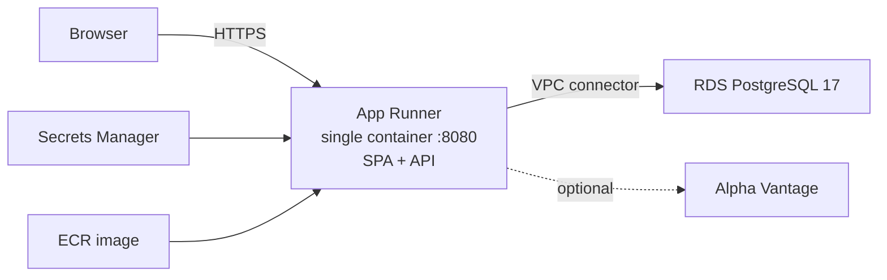

# AWS App Runner Deployment — Plan

Version: 1.0  
Status: Done — guide written  
Date: 2026-07-27

Companion documents:

- **Deploy guide:** [`AWS-DEPLOYMENT.md`](AWS-DEPLOYMENT.md)
- Local machine setup: [`MACHINE-SETUP.md`](MACHINE-SETUP.md)
- Backend packaging / env vars: [`backend/README.md`](../backend/README.md)
- Container build: [`backend/Dockerfile`](../backend/Dockerfile)

Documentation only — no app or IaC changes.

---

## Chosen topology (locked)

| Piece | Choice |
|-------|--------|
| **Compute** | AWS App Runner from an ECR image built with [`backend/Dockerfile`](../backend/Dockerfile) (JVM — faster first deploy than native) |
| **Data** | RDS PostgreSQL 17 (matches `postgres:17` in compose) |
| **Frontend** | Baked into the same container (SPA + API, same origin `/api/v1`); no S3/CloudFront |
| **Secrets** | Secrets Manager (or App Runner runtime env) for `POSTGRES_*`, `APP_AUTH_*`, optional `ALPHAVANTAGE_API_KEY` |
| **Networking** | App Runner VPC connector into private subnets; RDS not publicly accessible |
| **Scale** | 1 App Runner instance (quote cache / rate-limiter is in-memory) |

---

## Guide outline (`AWS-DEPLOYMENT.md`)

1. **What you are deploying** — architecture; SPA is not a separate host
2. **Prerequisites** — AWS account, `aws` CLI v2, Docker; optional domain; cost ballpark
3. **Variables** — shell exports (`AWS_REGION`, `ACCOUNT_ID`, `APP_NAME`, DB password, auth username)
4. **Networking** — VPC / subnets; security groups (RDS allows 5432 only from App Runner SG)
5. **RDS** — `aws rds create-db-instance` (PostgreSQL 17, `db.t4g.micro` or `db.t3.micro`, single-AZ, private)
6. **Secrets** — DB password + auth bcrypt hash (`htpasswd` command from backend README)
7. **ECR** — create repo; `docker build -f backend/Dockerfile` from **repo root**; push (`linux/amd64` note for Apple Silicon)
8. **App Runner** — VPC connector; service from ECR, port `8080`, health `/actuator/health`, env vars; **do not** set `SPRING_PROFILES_ACTIVE=local`
9. **TLS / URL** — default `*.awsapprunner.com` HTTPS; optional custom domain (ACM)
10. **Verify** — health curl (no auth); browser Basic auth; authenticated API curl; Liquibase success in logs; optional quotes if key set
11. **Update / redeploy** — rebuild, push, `aws apprunner start-deployment`
12. **Logs & ops** — CloudWatch / App Runner events
13. **Tear down** — service → connector → ECR → RDS (snapshot warning) → secrets → SGs
14. **Troubleshooting** — SG blocked, bad env vars, bcrypt format, `amd64` mismatch, `local` profile in prod

---

## Defaults the guide will use

| Setting | Value |
|---------|-------|
| Region | `$AWS_REGION` (example `ca-central-1`) |
| Image | JVM [`backend/Dockerfile`](../backend/Dockerfile), not native |
| DB | PostgreSQL 17, name `investment_tracker` |
| Port / health | `8080` / `/actuator/health` |
| Auth | HTTP Basic via env (on by default when `local` profile is absent) |
| Instances | Min 1, max 1 recommended |

---

## Out of scope

- Terraform / CDK / CloudFormation
- Splitting frontend to S3
- Multi-AZ / HA beyond a short “next steps” note
- CI/CD pipelines
- Application code changes

---

## Delivered

Full CLI walkthrough: [`AWS-DEPLOYMENT.md`](AWS-DEPLOYMENT.md). Linked from the root and backend READMEs.
