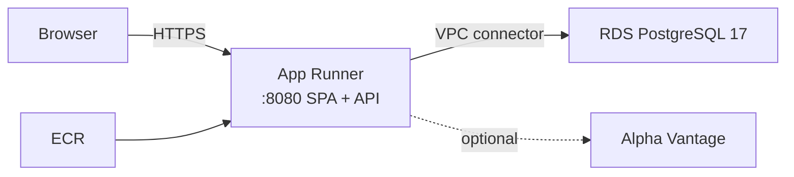

# AWS deployment (App Runner + RDS)

Deploy Investment Tracker as **one container** (React SPA + Spring Boot API on the same origin) on **AWS App Runner**, with **RDS PostgreSQL 17**. Everything below is meant to be run from your laptop with the AWS CLI.

Companion docs: [MACHINE-SETUP.md](MACHINE-SETUP.md) (local env vars / bcrypt), [AWS-DEPLOYMENT-PLAN.md](AWS-DEPLOYMENT-PLAN.md) (topology decisions), [backend/README.md](../backend/README.md) (Docker images).



There is **no separate frontend host**. The Docker image builds the SPA and serves it from the API, so the browser keeps a relative `/api/v1` base URL and one HTTP Basic login for UI + API.

---

## 1. What you get

| Piece | AWS service | Notes |
|-------|-------------|--------|
| App + UI | App Runner | Pulls image from ECR; HTTPS URL out of the box |
| Database | RDS PostgreSQL 17 | Private; reachable only via App Runner’s VPC connector |
| Image registry | ECR | Built from [`backend/Dockerfile`](../backend/Dockerfile) (JVM) |
| Live quotes | Alpha Vantage (external) | Optional; needs NAT if the VPC connector has no internet path |

**Not used:** S3/CloudFront for the SPA, Elastic Beanstalk, ECS, Cognito.

---

## 2. Prerequisites

```bash
# AWS CLI v2 + credentials for an account that can create VPC/RDS/ECR/App Runner/IAM
aws --version
aws sts get-caller-identity

# Docker (builds the image; on Apple Silicon you will target linux/amd64)
docker info
```

Also useful:

- A strong DB password and a separate app login password (HTTP Basic).
- Optional: a custom domain and Route 53 hosted zone (section 10).
- Optional: an [Alpha Vantage](https://www.alphavantage.co/support/#api-key) API key for live quotes.

**Rough monthly cost (ca-central-1 / personal, single-AZ, always on):** RDS `db.t4g.micro` + 20 GB gp3 ≈ a few dollars to ~\$15; App Runner 1 vCPU / 2 GB ≈ tens of dollars if left running; NAT Gateway (only if you want VPC egress to the internet) ≈ ~\$32 plus data. Tear down when idle (section 14).

---

## 3. Shell variables

Set these once per terminal session. Change region/name/passwords as you like.

```bash
export AWS_REGION=ca-central-1
export AWS_ACCOUNT_ID=$(aws sts get-caller-identity --query Account --output text)
export APP_NAME=investment-tracker

# Database
export DB_INSTANCE_ID=${APP_NAME}-pg
export DB_NAME=investment_tracker
export DB_USER=investment_tracker
# Generate something long; do not commit this:
export DB_PASSWORD='REPLACE_WITH_STRONG_DB_PASSWORD'

# HTTP Basic (browser login)
export APP_AUTH_USERNAME=tracker
# Plaintext only used to generate the hash below — App Runner gets the hash, not this:
export APP_AUTH_PASSWORD='REPLACE_WITH_APP_PASSWORD'

export APP_AUTH_PASSWORD_HASH=$(docker run --rm httpd:alpine \
  htpasswd -nbBC 10 "" "$APP_AUTH_PASSWORD" | cut -d: -f2)
# htpasswd may emit $2y$; Spring’s BCrypt accepts it. Keep the hash single-quoted when exporting later.

# Optional live quotes (leave empty to skip)
export ALPHAVANTAGE_API_KEY=

export ECR_URI=${AWS_ACCOUNT_ID}.dkr.ecr.${AWS_REGION}.amazonaws.com/${APP_NAME}
```

Confirm:

```bash
echo "account=$AWS_ACCOUNT_ID region=$AWS_REGION"
echo "hash starts with: ${APP_AUTH_PASSWORD_HASH:0:7}..."   # expect $2y$10$ or $2a$10$
```

---

## 4. Networking

App Runner reaches RDS through a **VPC connector**. RDS stays **not** publicly accessible. Outbound internet from the app (Alpha Vantage) only works if the connector’s subnets have a route to a **NAT Gateway** (or equivalent). If you leave `ALPHAVANTAGE_API_KEY` empty, you can skip NAT and save that cost.

### 4.1 Use the default VPC (simplest)

```bash
export VPC_ID=$(aws ec2 describe-vpcs --region "$AWS_REGION" \
  --filters Name=isDefault,Values=true \
  --query 'Vpcs[0].VpcId' --output text)
echo "VPC_ID=$VPC_ID"

# Pick two subnets in different AZs (default VPC subnets are fine for a personal deploy)
export SUBNET_IDS=$(aws ec2 describe-subnets --region "$AWS_REGION" \
  --filters Name=vpc-id,Values="$VPC_ID" \
  --query 'Subnets[0:2].SubnetId' --output text | tr '\t' ',')
echo "SUBNET_IDS=$SUBNET_IDS"
```

If `VPC_ID` is `None`, create a VPC in the console or with `aws ec2 create-vpc`, then set `VPC_ID` / `SUBNET_IDS` yourself. For Alpha Vantage later, put the connector on **private** subnets that route through a NAT.

### 4.2 Security groups

```bash
# SG for the App Runner VPC connector ENIs
export APPRUNNER_SG_ID=$(aws ec2 create-security-group --region "$AWS_REGION" \
  --group-name ${APP_NAME}-apprunner \
  --description "App Runner VPC connector for ${APP_NAME}" \
  --vpc-id "$VPC_ID" \
  --query GroupId --output text)

# Allow all egress from the connector (RDS + optional internet via NAT)
aws ec2 authorize-security-group-egress --region "$AWS_REGION" \
  --group-id "$APPRUNNER_SG_ID" \
  --ip-permissions IpProtocol=-1,IpRanges='[{CidrIp=0.0.0.0/0}]' 2>/dev/null || true

# SG for RDS — only Postgres from the App Runner SG
export RDS_SG_ID=$(aws ec2 create-security-group --region "$AWS_REGION" \
  --group-name ${APP_NAME}-rds \
  --description "RDS for ${APP_NAME}" \
  --vpc-id "$VPC_ID" \
  --query GroupId --output text)

aws ec2 authorize-security-group-ingress --region "$AWS_REGION" \
  --group-id "$RDS_SG_ID" \
  --protocol tcp --port 5432 \
  --source-group "$APPRUNNER_SG_ID"

echo "APPRUNNER_SG_ID=$APPRUNNER_SG_ID"
echo "RDS_SG_ID=$RDS_SG_ID"
```

---

## 5. RDS PostgreSQL 17

### 5.1 DB subnet group

```bash
# Same two subnets; RDS requires a subnet group covering ≥2 AZs
aws rds create-db-subnet-group --region "$AWS_REGION" \
  --db-subnet-group-name ${APP_NAME}-subnets \
  --db-subnet-group-description "Subnets for ${APP_NAME}" \
  --subnet-ids $(echo "$SUBNET_IDS" | tr ',' ' ')
```

### 5.2 Create the instance

```bash
aws rds create-db-instance --region "$AWS_REGION" \
  --db-instance-identifier "$DB_INSTANCE_ID" \
  --db-instance-class db.t4g.micro \
  --engine postgres \
  --engine-version 17 \
  --master-username "$DB_USER" \
  --master-user-password "$DB_PASSWORD" \
  --allocated-storage 20 \
  --storage-type gp3 \
  --db-name "$DB_NAME" \
  --vpc-security-group-ids "$RDS_SG_ID" \
  --db-subnet-group-name ${APP_NAME}-subnets \
  --no-publicly-accessible \
  --backup-retention-period 7 \
  --no-multi-az \
  --storage-encrypted
```

If `db.t4g.micro` is unavailable in your region, use `db.t3.micro`. If engine version `17` is rejected, list supported versions:

```bash
aws rds describe-db-engine-versions --region "$AWS_REGION" \
  --engine postgres --query 'DBEngineVersions[].EngineVersion' --output text
```

Wait until available (often 5–15 minutes):

```bash
aws rds wait db-instance-available --region "$AWS_REGION" \
  --db-instance-identifier "$DB_INSTANCE_ID"

export POSTGRES_HOST=$(aws rds describe-db-instances --region "$AWS_REGION" \
  --db-instance-identifier "$DB_INSTANCE_ID" \
  --query 'DBInstances[0].Endpoint.Address' --output text)
echo "POSTGRES_HOST=$POSTGRES_HOST"
```

Liquibase runs automatically on first app startup and creates the schema. You do **not** run migrations by hand.

---

## 6. IAM role for App Runner → ECR

App Runner needs a role that can pull your image:

```bash
cat > /tmp/apprunner-ecr-trust.json <<'EOF'
{
  "Version": "2012-10-17",
  "Statement": [
    {
      "Effect": "Allow",
      "Principal": { "Service": "build.apprunner.amazonaws.com" },
      "Action": "sts:AssumeRole"
    },
    {
      "Effect": "Allow",
      "Principal": { "Service": "tasks.apprunner.amazonaws.com" },
      "Action": "sts:AssumeRole"
    }
  ]
}
EOF

aws iam create-role \
  --role-name ${APP_NAME}-apprunner-ecr \
  --assume-role-policy-document file:///tmp/apprunner-ecr-trust.json

aws iam attach-role-policy \
  --role-name ${APP_NAME}-apprunner-ecr \
  --policy-arn arn:aws:iam::aws:policy/service-role/AWSAppRunnerServicePolicyForECRAccess

export ACCESS_ROLE_ARN=$(aws iam get-role \
  --role-name ${APP_NAME}-apprunner-ecr \
  --query Role.Arn --output text)
echo "ACCESS_ROLE_ARN=$ACCESS_ROLE_ARN"

# IAM can take a short while to become assumable
sleep 10
```

This guide passes DB password and auth hash as App Runner **runtime environment variables** (fine for a personal deploy; rotate by updating the service). For production, move them to Secrets Manager and use `RuntimeEnvironmentSecrets` plus an instance role with `secretsmanager:GetSecretValue`.

---

## 7. Build and push the image (ECR)

### 7.1 Repository + login

```bash
aws ecr create-repository --region "$AWS_REGION" \
  --repository-name "$APP_NAME" \
  --image-scanning-configuration scanOnPush=true

aws ecr get-login-password --region "$AWS_REGION" \
  | docker login --username AWS --password-stdin \
    ${AWS_ACCOUNT_ID}.dkr.ecr.${AWS_REGION}.amazonaws.com
```

### 7.2 Build (from repository root)

The Dockerfile context is the **repo root** (it builds `frontend/` then packages it into the JAR).

```bash
cd /path/to/investment-tracker   # repository root

# App Runner runs linux/amd64. Required on Apple Silicon:
docker build --platform linux/amd64 \
  -f backend/Dockerfile \
  -t ${APP_NAME}:jvm .

docker tag ${APP_NAME}:jvm ${ECR_URI}:latest
docker push ${ECR_URI}:latest
```

Build takes several minutes (Node SPA + Maven). Prefer the JVM image for the first deploy; [`Dockerfile.native`](../backend/Dockerfile.native) is smaller/faster to start but needs ~8 GB RAM and much longer to build.

---

## 8. App Runner VPC connector

```bash
export VPC_CONNECTOR_ARN=$(aws apprunner create-vpc-connector --region "$AWS_REGION" \
  --vpc-connector-name ${APP_NAME}-connector \
  --subnets $(echo "$SUBNET_IDS" | tr ',' ' ') \
  --security-groups "$APPRUNNER_SG_ID" \
  --query VpcConnector.VpcConnectorArn --output text)
echo "VPC_CONNECTOR_ARN=$VPC_CONNECTOR_ARN"
```

---

## 9. Create the App Runner service

**Do not** set `SPRING_PROFILES_ACTIVE=local`. That profile turns auth off and points at laptop defaults.

```bash
# Escape carefully: bcrypt hashes contain $ which the shell expands
cat > /tmp/${APP_NAME}-create-service.json <<EOF
{
  "ServiceName": "${APP_NAME}",
  "SourceConfiguration": {
    "AuthenticationConfiguration": {
      "AccessRoleArn": "${ACCESS_ROLE_ARN}"
    },
    "AutoDeploymentsEnabled": false,
    "ImageRepository": {
      "ImageIdentifier": "${ECR_URI}:latest",
      "ImageRepositoryType": "ECR",
      "ImageConfiguration": {
        "Port": "8080",
        "RuntimeEnvironmentVariables": {
          "POSTGRES_HOST": "${POSTGRES_HOST}",
          "POSTGRES_PORT": "5432",
          "POSTGRES_DB": "${DB_NAME}",
          "POSTGRES_USER": "${DB_USER}",
          "POSTGRES_PASSWORD": "${DB_PASSWORD}",
          "APP_AUTH_USERNAME": "${APP_AUTH_USERNAME}",
          "APP_AUTH_PASSWORD_HASH": "${APP_AUTH_PASSWORD_HASH}",
          "TZ": "America/Toronto",
          "ALPHAVANTAGE_API_KEY": "${ALPHAVANTAGE_API_KEY}"
        }
      }
    }
  },
  "InstanceConfiguration": {
    "Cpu": "1 vCPU",
    "Memory": "2 GB"
  },
  "HealthCheckConfiguration": {
    "Protocol": "HTTP",
    "Path": "/actuator/health",
    "Interval": 10,
    "Timeout": 5,
    "HealthyThreshold": 1,
    "UnhealthyThreshold": 5
  },
  "NetworkConfiguration": {
    "EgressConfiguration": {
      "EgressType": "VPC",
      "VpcConnectorArn": "${VPC_CONNECTOR_ARN}"
    }
  }
}
EOF

export SERVICE_ARN=$(aws apprunner create-service --region "$AWS_REGION" \
  --cli-input-json file:///tmp/${APP_NAME}-create-service.json \
  --query Service.ServiceArn --output text)
echo "SERVICE_ARN=$SERVICE_ARN"
```

Optional: keep a single instance so the in-memory quote cache/rate-limiter stays consistent — create an auto-scaling config with max size 1 and attach it (`aws apprunner create-auto-scaling-configuration`, then update the service). Default scaling is fine for a smoke test.

Wait until running:

```bash
# Status moves CREATE_FAILED / OPERATION_IN_PROGRESS → RUNNING
while true; do
  STATUS=$(aws apprunner describe-service --region "$AWS_REGION" \
    --service-arn "$SERVICE_ARN" --query Service.Status --output text)
  echo "$(date -u +%H:%M:%S) status=$STATUS"
  [[ "$STATUS" == "RUNNING" || "$STATUS" == "CREATE_FAILED" ]] && break
  sleep 20
done

export APP_URL=$(aws apprunner describe-service --region "$AWS_REGION" \
  --service-arn "$SERVICE_ARN" --query Service.ServiceUrl --output text)
echo "https://${APP_URL}"
```

App Runner provides HTTPS on `*.awsapprunner.com`. The app listens on HTTP `:8080` behind that; `server.forward-headers-strategy: framework` is already set so redirects honour the external host.

---

## 10. Custom domain (optional)

```bash
# Request / validate a cert in ACM in the *same region* as App Runner, then:
aws apprunner associate-custom-domain --region "$AWS_REGION" \
  --service-arn "$SERVICE_ARN" \
  --domain-name app.example.com

# Follow the DNS records App Runner returns (CNAME validation + traffic).
aws apprunner describe-custom-domains --region "$AWS_REGION" \
  --service-arn "$SERVICE_ARN"
```

Skip this until the default URL works.

---

## 11. Verify it works

Replace `APP_URL` if your shell lost it (`aws apprunner describe-service ...`).

### 11.1 Health (no auth)

```bash
curl -sS "https://${APP_URL}/actuator/health"
# expect: {"status":"UP"}

curl -sS -o /dev/null -w "%{http_code}\n" \
  "https://${APP_URL}/actuator/health/readiness"
# expect: 200
```

### 11.2 Browser

Open `https://${APP_URL}/`. The browser should prompt for HTTP Basic credentials (`APP_AUTH_USERNAME` / the plaintext you hashed). After login you should see the SPA. Deep links (e.g. refresh on a client route) should still return the app, not a raw 404.

### 11.3 API with Basic auth

```bash
curl -sS -u "${APP_AUTH_USERNAME}:${APP_AUTH_PASSWORD}" \
  "https://${APP_URL}/api/v1/accounts"

curl -sS -u "${APP_AUTH_USERNAME}:${APP_AUTH_PASSWORD}" \
  "https://${APP_URL}/api/v1/securities"
# Seed securities from Liquibase should appear as JSON
```

Unauthenticated API calls should be `401`:

```bash
curl -sS -o /dev/null -w "%{http_code}\n" "https://${APP_URL}/api/v1/accounts"
# expect: 401
```

### 11.4 Liquibase / startup logs

```bash
aws apprunner list-operations --region "$AWS_REGION" --service-arn "$SERVICE_ARN"

# Application logs (log group name includes the service id; list to find it):
aws logs describe-log-groups --region "$AWS_REGION" \
  --log-group-name-prefix "/aws/apprunner/${APP_NAME}" \
  --query 'logGroups[].logGroupName' --output text
```

In the application log stream, look for Liquibase changeset success and Tomcat started on port 8080. A failure to reach Postgres usually shows JDBC connection errors and the service may flap unhealthy.

### 11.5 Quotes (optional)

Only if `ALPHAVANTAGE_API_KEY` is set **and** the VPC connector can reach the internet (NAT):

```bash
curl -sS -u "${APP_AUTH_USERNAME}:${APP_AUTH_PASSWORD}" \
  "https://${APP_URL}/api/v1/quotes?symbol=XEI.TO"
```

---

## 12. Update / redeploy

```bash
cd /path/to/investment-tracker

docker build --platform linux/amd64 -f backend/Dockerfile -t ${APP_NAME}:jvm .
docker tag ${APP_NAME}:jvm ${ECR_URI}:latest
docker push ${ECR_URI}:latest

aws apprunner start-deployment --region "$AWS_REGION" --service-arn "$SERVICE_ARN"
```

To change env vars (password rotation, add Alpha Vantage key):

```bash
aws apprunner update-service --region "$AWS_REGION" \
  --service-arn "$SERVICE_ARN" \
  --source-configuration file:///tmp/${APP_NAME}-create-service.json
# (edit the JSON first; SourceConfiguration shape matches create)
```

---

## 13. Logs and day-to-day ops

| What | Command / place |
|------|-----------------|
| Service status / URL | `aws apprunner describe-service --service-arn "$SERVICE_ARN"` |
| Recent operations | `aws apprunner list-operations --service-arn "$SERVICE_ARN"` |
| App stdout | CloudWatch Logs under `/aws/apprunner/${APP_NAME}/...` |
| RDS status | `aws rds describe-db-instances --db-instance-identifier "$DB_INSTANCE_ID"` |

Health probes must stay on `/actuator/health` (or `/actuator/health/readiness`). Those paths are anonymous; everything else requires Basic auth.

---

## 14. Tear down (avoid surprise bills)

Order matters: delete the service before the connector and RDS.

```bash
aws apprunner delete-service --region "$AWS_REGION" --service-arn "$SERVICE_ARN"
# wait until gone
aws apprunner wait service-deleted --region "$AWS_REGION" --service-arn "$SERVICE_ARN" 2>/dev/null \
  || until [[ "$(aws apprunner describe-service --region "$AWS_REGION" --service-arn "$SERVICE_ARN" \
       --query Service.Status --output text 2>/dev/null)" == "" ]]; do sleep 15; done

aws apprunner delete-vpc-connector --region "$AWS_REGION" \
  --vpc-connector-arn "$VPC_CONNECTOR_ARN"

# Snapshot first if you care about data:
# aws rds create-db-snapshot --db-instance-identifier "$DB_INSTANCE_ID" \
#   --db-snapshot-identifier ${DB_INSTANCE_ID}-final
aws rds delete-db-instance --region "$AWS_REGION" \
  --db-instance-identifier "$DB_INSTANCE_ID" \
  --skip-final-snapshot   # or --final-db-snapshot-identifier ...

aws rds delete-db-subnet-group --region "$AWS_REGION" \
  --db-subnet-group-name ${APP_NAME}-subnets

aws ecr batch-delete-image --region "$AWS_REGION" --repository-name "$APP_NAME" \
  --image-ids imageTag=latest 2>/dev/null || true
aws ecr delete-repository --region "$AWS_REGION" \
  --repository-name "$APP_NAME" --force

aws iam detach-role-policy \
  --role-name ${APP_NAME}-apprunner-ecr \
  --policy-arn arn:aws:iam::aws:policy/service-role/AWSAppRunnerServicePolicyForECRAccess
aws iam delete-role --role-name ${APP_NAME}-apprunner-ecr

aws ec2 delete-security-group --region "$AWS_REGION" --group-id "$RDS_SG_ID"
aws ec2 delete-security-group --region "$AWS_REGION" --group-id "$APPRUNNER_SG_ID"
```

Delete any NAT Gateway / Elastic IP you created if you added internet egress.

---

## 15. Troubleshooting

| Symptom | Likely cause | What to check |
|---------|--------------|---------------|
| Service never becomes `RUNNING`; health fails | App cannot reach Postgres | RDS SG allows `APPRUNNER_SG_ID` on 5432; `POSTGRES_HOST` is the RDS endpoint; VPC connector subnets are in the same VPC as RDS |
| Startup crash: auth / datasource | Missing env vars | `POSTGRES_USER`, `POSTGRES_PASSWORD`, `APP_AUTH_USERNAME`, `APP_AUTH_PASSWORD_HASH` all set; **no** `SPRING_PROFILES_ACTIVE=local` |
| Browser login always fails | Bad hash or wrong password | Re-run `htpasswd`; hash should look like `$2y$10$...` with no `{bcrypt}` prefix; use the **plaintext** you hashed in `curl -u` |
| Image pull errors | ECR role / platform | `ACCESS_ROLE_ARN` attached; image built with `--platform linux/amd64` |
| `exec format error` | Arm image on amd64 | Rebuild with `--platform linux/amd64` and push again |
| Quotes fail, rest of app OK | No internet from VPC connector | Add NAT on connector subnets, or clear `ALPHAVANTAGE_API_KEY` and ignore quotes |
| API `401`, health `200` | Expected | Health is public; API needs Basic auth |
| SPA loads but API calls fail in browser | Wrong deploy shape | You must use the **bundled** image, not a separate static host (no CORS in the app) |

---

## 16. Environment variable checklist

| Variable | Required | Notes |
|----------|----------|--------|
| `POSTGRES_HOST` | Yes | RDS endpoint hostname |
| `POSTGRES_PORT` | No | Default `5432` |
| `POSTGRES_DB` | No | Default `investment_tracker` |
| `POSTGRES_USER` | Yes | Master user from section 5 |
| `POSTGRES_PASSWORD` | Yes | Same password as RDS |
| `APP_AUTH_USERNAME` | Yes | Browser / API Basic user |
| `APP_AUTH_PASSWORD_HASH` | Yes | bcrypt digest only |
| `ALPHAVANTAGE_API_KEY` | No | Empty → quotes disabled |
| `TZ` | Recommended | Image default `America/Toronto` |
| `SPRING_PROFILES_ACTIVE` | **Leave unset** | Never `local` in AWS |

---

## 17. Next steps (out of scope here)

- Secrets Manager instead of plaintext env vars
- Multi-AZ RDS and automated backups retention policy you are happy with
- CI: build/push on git tag, then `start-deployment`
- Native image (`Dockerfile.native`) once JVM deploy is proven
- Custom domain + tighter security group / WAF if exposed beyond personal use
