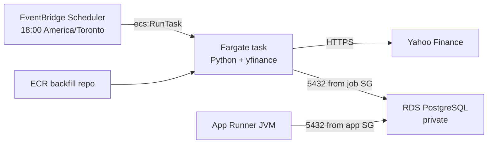

# Scheduled price backfill (EventBridge Scheduler + Fargate)

After the [App Runner + RDS deploy](AWS-DEPLOYMENT.md) is up, this adds a **nightly yfinance job** that upserts the last 7 days of unadjusted closes into `price_snapshot` and overlays the latest session quote (same as a laptop run). Dashboard period returns (5D / 1M / 6M / 1Y) need those rows. After the regular session, that overlay is at or near Close; the next day's official Close still replaces the row if they differ.

Copy-paste order for this account (including the app image and RDS) is in [AWS-BUILD-AND-DEPLOY.md](AWS-BUILD-AND-DEPLOY.md). Use **`us-east-1`** there; do not mix with the `ca-central-1` example below.

The Java API is not involved. The job is the existing [`scripts/backfill_price_snapshots.py`](../scripts/backfill_price_snapshots.py) in a container, with the same `POSTGRES_*` values as App Runner.

EventBridge Scheduler **does not run Docker images**. It calls `ecs:RunTask`. The container runs on **Fargate** in the default VPC public subnets with a public IP so it can reach Yahoo **and** private RDS — no NAT Gateway.



Two run modes, one image:

| Mode | Command | When |
|------|---------|------|
| Nightly (schedule) | `python backfill_price_snapshots.py --days 7` (image `CMD`) | After North American close; also refreshes the latest session quote |
| Full history | same script, no `--days` | New holding, or catch-up from first transaction |

---

## 1. Prerequisites

- App Runner + private RDS already deployed from [AWS-DEPLOYMENT.md](AWS-DEPLOYMENT.md) (same VPC, same `POSTGRES_*`).
- AWS CLI v2 and Docker, as in that guide. On Apple Silicon, images are `linux/amd64`.

Reuse the same terminal exports (`AWS_REGION`, `AWS_ACCOUNT_ID`, `APP_NAME`, `VPC_ID`, `SUBNET_IDS`, `RDS_SG_ID`, `DB_NAME`, `DB_USER`, `DB_PASSWORD`, `POSTGRES_HOST`). If the shell is new:

```bash
export AWS_REGION=ca-central-1
export AWS_ACCOUNT_ID=$(aws sts get-caller-identity --query Account --output text)
export APP_NAME=investment-tracker

export VPC_ID=$(aws ec2 describe-vpcs --region "$AWS_REGION" \
  --filters Name=isDefault,Values=true \
  --query 'Vpcs[0].VpcId' --output text)

export SUBNET_IDS=$(aws ec2 describe-subnets --region "$AWS_REGION" \
  --filters Name=vpc-id,Values="$VPC_ID" \
  --query 'Subnets[0:2].SubnetId' --output text | tr '\t' ',')

export RDS_SG_ID=$(aws ec2 describe-security-groups --region "$AWS_REGION" \
  --filters Name=vpc-id,Values="$VPC_ID" Name=group-name,Values=${APP_NAME}-rds \
  --query 'SecurityGroups[0].GroupId' --output text)

export DB_INSTANCE_ID=${APP_NAME}-pg
export POSTGRES_HOST=$(aws rds describe-db-instances --region "$AWS_REGION" \
  --db-instance-identifier "$DB_INSTANCE_ID" \
  --query 'DBInstances[0].Endpoint.Address' --output text)

export DB_NAME=investment_tracker
export DB_USER=investment_tracker
# Same master password you set when creating RDS — not stored in AWS unless you saved it:
# export DB_PASSWORD='...'

export BACKFILL_ECR_URI=${AWS_ACCOUNT_ID}.dkr.ecr.${AWS_REGION}.amazonaws.com/${APP_NAME}-backfill
```

Confirm none of those came back `None`.

**Cost:** Fargate 0.25 vCPU / 512 MB for a minute or two per night is cents per month. EventBridge Scheduler and an idle Fargate cluster are free. Do **not** add a NAT Gateway for this job.

---

## 2. Security group

A dedicated SG for the task. RDS stays `--no-publicly-accessible`; add one ingress rule so 5432 is allowed from this SG as well as the App Runner SG.

```bash
export BACKFILL_SG_ID=$(aws ec2 create-security-group --region "$AWS_REGION" \
  --group-name ${APP_NAME}-backfill \
  --description "Fargate price backfill for ${APP_NAME}" \
  --vpc-id "$VPC_ID" \
  --query GroupId --output text)

# Default SG egress is already 0.0.0.0/0 (Yahoo + RDS). Re-authorize is a no-op if it exists:
aws ec2 authorize-security-group-egress --region "$AWS_REGION" \
  --group-id "$BACKFILL_SG_ID" \
  --ip-permissions IpProtocol=-1,IpRanges='[{CidrIp=0.0.0.0/0}]' 2>/dev/null || true

aws ec2 authorize-security-group-ingress --region "$AWS_REGION" \
  --group-id "$RDS_SG_ID" \
  --protocol tcp --port 5432 \
  --source-group "$BACKFILL_SG_ID"

echo "BACKFILL_SG_ID=$BACKFILL_SG_ID"
```

---

## 3. ECR image

### 3.1 Repository + login

```bash
aws ecr create-repository --region "$AWS_REGION" \
  --repository-name ${APP_NAME}-backfill \
  --image-scanning-configuration scanOnPush=true

aws ecr get-login-password --region "$AWS_REGION" \
  | docker login --username AWS --password-stdin \
    ${AWS_ACCOUNT_ID}.dkr.ecr.${AWS_REGION}.amazonaws.com
```

### 3.2 Build and push (from repository root)

```bash
cd /path/to/investment-tracker

docker build --platform linux/amd64 \
  -f scripts/Dockerfile \
  -t ${APP_NAME}-backfill \
  scripts/

docker tag ${APP_NAME}-backfill ${BACKFILL_ECR_URI}:latest
docker push ${BACKFILL_ECR_URI}:latest
```

The image `CMD` is `--days 7`. Fargate pulls `:latest` on every task start, so a later `docker push` is enough to change the script; you do not need to re-register the task definition unless env vars change.

---

## 4. IAM

Three roles: ECS **execution** (pull image, write logs), ECS **task** (the process itself; no AWS API calls), EventBridge Scheduler **invoke** (`ecs:RunTask` + `iam:PassRole`).

```bash
cat > /tmp/ecs-tasks-trust.json <<'EOF'
{
  "Version": "2012-10-17",
  "Statement": [
    {
      "Effect": "Allow",
      "Principal": { "Service": "ecs-tasks.amazonaws.com" },
      "Action": "sts:AssumeRole"
    }
  ]
}
EOF

cat > /tmp/scheduler-trust.json <<'EOF'
{
  "Version": "2012-10-17",
  "Statement": [
    {
      "Effect": "Allow",
      "Principal": { "Service": "scheduler.amazonaws.com" },
      "Action": "sts:AssumeRole"
    }
  ]
}
EOF

aws iam create-role \
  --role-name ${APP_NAME}-backfill-execution \
  --assume-role-policy-document file:///tmp/ecs-tasks-trust.json

aws iam attach-role-policy \
  --role-name ${APP_NAME}-backfill-execution \
  --policy-arn arn:aws:iam::aws:policy/service-role/AmazonECSTaskExecutionRolePolicy

aws iam create-role \
  --role-name ${APP_NAME}-backfill-task \
  --assume-role-policy-document file:///tmp/ecs-tasks-trust.json

aws iam create-role \
  --role-name ${APP_NAME}-backfill-scheduler \
  --assume-role-policy-document file:///tmp/scheduler-trust.json

export BACKFILL_EXECUTION_ROLE_ARN=$(aws iam get-role \
  --role-name ${APP_NAME}-backfill-execution --query Role.Arn --output text)
export BACKFILL_TASK_ROLE_ARN=$(aws iam get-role \
  --role-name ${APP_NAME}-backfill-task --query Role.Arn --output text)
export BACKFILL_SCHEDULER_ROLE_ARN=$(aws iam get-role \
  --role-name ${APP_NAME}-backfill-scheduler --query Role.Arn --output text)

cat > /tmp/${APP_NAME}-backfill-scheduler-policy.json <<EOF
{
  "Version": "2012-10-17",
  "Statement": [
    {
      "Effect": "Allow",
      "Action": "ecs:RunTask",
      "Resource": [
        "arn:aws:ecs:${AWS_REGION}:${AWS_ACCOUNT_ID}:task-definition/${APP_NAME}-backfill",
        "arn:aws:ecs:${AWS_REGION}:${AWS_ACCOUNT_ID}:task-definition/${APP_NAME}-backfill:*"
      ],
      "Condition": {
        "ArnEquals": {
          "ecs:cluster": "arn:aws:ecs:${AWS_REGION}:${AWS_ACCOUNT_ID}:cluster/${APP_NAME}"
        }
      }
    },
    {
      "Effect": "Allow",
      "Action": "iam:PassRole",
      "Resource": [
        "${BACKFILL_EXECUTION_ROLE_ARN}",
        "${BACKFILL_TASK_ROLE_ARN}"
      ]
    }
  ]
}
EOF

aws iam put-role-policy \
  --role-name ${APP_NAME}-backfill-scheduler \
  --policy-name RunBackfillTask \
  --policy-document file:///tmp/${APP_NAME}-backfill-scheduler-policy.json

# IAM can take a short while to become assumable
sleep 10
```

---

## 5. Cluster, logs, task definition

```bash
aws ecs create-cluster --region "$AWS_REGION" \
  --cluster-name "$APP_NAME" \
  --capacity-providers FARGATE \
  --default-capacity-provider-strategy capacityProvider=FARGATE,weight=1

aws logs create-log-group --region "$AWS_REGION" \
  --log-group-name /ecs/${APP_NAME}-backfill

# Comma-separated SUBNET_IDS → JSON array
export SUBNET_JSON=$(printf '"%s",' ${SUBNET_IDS//,/ } | sed 's/,$//')

# Escape $ in the password for this heredoc (same issue as App Runner bcrypt hashes)
cat > /tmp/${APP_NAME}-backfill-task-def.json <<EOF
{
  "family": "${APP_NAME}-backfill",
  "networkMode": "awsvpc",
  "requiresCompatibilities": ["FARGATE"],
  "cpu": "256",
  "memory": "512",
  "executionRoleArn": "${BACKFILL_EXECUTION_ROLE_ARN}",
  "taskRoleArn": "${BACKFILL_TASK_ROLE_ARN}",
  "containerDefinitions": [
    {
      "name": "backfill",
      "image": "${BACKFILL_ECR_URI}:latest",
      "essential": true,
      "environment": [
        { "name": "TZ", "value": "America/Toronto" },
        { "name": "POSTGRES_HOST", "value": "${POSTGRES_HOST}" },
        { "name": "POSTGRES_PORT", "value": "5432" },
        { "name": "POSTGRES_DB", "value": "${DB_NAME}" },
        { "name": "POSTGRES_USER", "value": "${DB_USER}" },
        { "name": "POSTGRES_PASSWORD", "value": "${DB_PASSWORD}" }
      ],
      "logConfiguration": {
        "logDriver": "awslogs",
        "options": {
          "awslogs-group": "/ecs/${APP_NAME}-backfill",
          "awslogs-region": "${AWS_REGION}",
          "awslogs-stream-prefix": "backfill"
        }
      }
    }
  ]
}
EOF

aws ecs register-task-definition --region "$AWS_REGION" \
  --cli-input-json file:///tmp/${APP_NAME}-backfill-task-def.json

export BACKFILL_TASK_DEF_ARN=$(aws ecs describe-task-definition --region "$AWS_REGION" \
  --task-definition ${APP_NAME}-backfill \
  --query taskDefinition.taskDefinitionArn --output text)
echo "BACKFILL_TASK_DEF_ARN=$BACKFILL_TASK_DEF_ARN"
```

If pandas OOMs, re-register with `"memory": "1024"` (and `"cpu": "512"`).

This guide puts the DB password in the task definition, matching App Runner runtime env vars. Rotate by editing the JSON and registering a new revision. For a tighter setup, move `POSTGRES_PASSWORD` to Secrets Manager and use `secrets` on the container plus `secretsmanager:GetSecretValue` on the execution role.

---

## 6. EventBridge Scheduler

18:00 **America/Toronto** so the clock stays correct across EDT/EST. Do not convert the cron to UTC by hand.

The schedule targets the **family** name (latest `ACTIVE` revision). `AssignPublicIp` must be `ENABLED` so yfinance can leave the VPC without NAT.

```bash
cat > /tmp/${APP_NAME}-backfill-schedule-target.json <<EOF
{
  "Arn": "arn:aws:ecs:${AWS_REGION}:${AWS_ACCOUNT_ID}:cluster/${APP_NAME}",
  "RoleArn": "${BACKFILL_SCHEDULER_ROLE_ARN}",
  "EcsParameters": {
    "TaskDefinitionArn": "arn:aws:ecs:${AWS_REGION}:${AWS_ACCOUNT_ID}:task-definition/${APP_NAME}-backfill",
    "LaunchType": "FARGATE",
    "NetworkConfiguration": {
      "AwsvpcConfiguration": {
        "Subnets": [${SUBNET_JSON}],
        "SecurityGroups": ["${BACKFILL_SG_ID}"],
        "AssignPublicIp": "ENABLED"
      }
    }
  },
  "RetryPolicy": {
    "MaximumRetryAttempts": 1
  }
}
EOF

aws scheduler create-schedule --region "$AWS_REGION" \
  --name ${APP_NAME}-price-backfill \
  --description "Nightly yfinance price_snapshot catch-up (--days 7)" \
  --schedule-expression "cron(0 18 * * ? *)" \
  --schedule-expression-timezone "America/Toronto" \
  --flexible-time-window Mode=OFF \
  --state ENABLED \
  --target file:///tmp/${APP_NAME}-backfill-schedule-target.json
```

---

## 7. Verify

Run the nightly command once without waiting until 18:00:

```bash
aws ecs run-task --region "$AWS_REGION" \
  --cluster "$APP_NAME" \
  --task-definition ${APP_NAME}-backfill \
  --launch-type FARGATE \
  --network-configuration "awsvpcConfiguration={subnets=[${SUBNET_IDS}],securityGroups=[${BACKFILL_SG_ID}],assignPublicIp=ENABLED}"
```

Wait a minute, then:

```bash
aws logs tail /ecs/${APP_NAME}-backfill --region "$AWS_REGION" --since 15m
```

Look for `Backfilling N securities` and `upserted … rows`. `STOPPED` with exit `0` is success. Connection errors usually mean the RDS SG rule or `POSTGRES_HOST`. Yahoo warnings skip that ticker (same as the laptop script).

---

## 8. Day-to-day

- **Nightly:** do nothing. Scheduler starts a task at 18:00 America/Toronto. Logs: `/ecs/${APP_NAME}-backfill`.
- **Full history** (new holding, or first-txn → today):

```bash
aws ecs run-task --region "$AWS_REGION" \
  --cluster "$APP_NAME" \
  --task-definition ${APP_NAME}-backfill \
  --launch-type FARGATE \
  --network-configuration "awsvpcConfiguration={subnets=[${SUBNET_IDS}],securityGroups=[${BACKFILL_SG_ID}],assignPublicIp=ENABLED}" \
  --overrides '{"containerOverrides":[{"name":"backfill","command":["python","backfill_price_snapshots.py"]}]}'
```

- **Laptop:** venv in [`scripts/README.md`](../scripts/README.md), or the compose profile:

```bash
docker compose -f backend/docker-compose.yml --profile backfill run --rm price-backfill
# full history:
docker compose -f backend/docker-compose.yml --profile backfill run --rm price-backfill \
  python backfill_price_snapshots.py
```

---

## 9. Update the job image

```bash
cd /path/to/investment-tracker

docker build --platform linux/amd64 \
  -f scripts/Dockerfile \
  -t ${APP_NAME}-backfill \
  scripts/

docker tag ${APP_NAME}-backfill ${BACKFILL_ECR_URI}:latest
docker push ${BACKFILL_ECR_URI}:latest
```

The next `RunTask` pulls `:latest`. Re-register the task definition only if you change CPU/memory or env vars.

---

## 10. Tear down

Do this **before** deleting RDS in [AWS-DEPLOYMENT.md](AWS-DEPLOYMENT.md) section 14.

```bash
aws scheduler delete-schedule --region "$AWS_REGION" \
  --name ${APP_NAME}-price-backfill

# Stop any task still running (usually none):
aws ecs list-tasks --region "$AWS_REGION" --cluster "$APP_NAME" \
  --query 'taskArns[]' --output text

for arn in $(aws ecs list-task-definitions --region "$AWS_REGION" \
  --family-prefix ${APP_NAME}-backfill --query 'taskDefinitionArns[]' --output text); do
  aws ecs deregister-task-definition --region "$AWS_REGION" --task-definition "$arn"
done

aws ecs delete-cluster --region "$AWS_REGION" --cluster "$APP_NAME"

aws logs delete-log-group --region "$AWS_REGION" \
  --log-group-name /ecs/${APP_NAME}-backfill

aws ecr batch-delete-image --region "$AWS_REGION" \
  --repository-name ${APP_NAME}-backfill \
  --image-ids imageTag=latest 2>/dev/null || true
aws ecr delete-repository --region "$AWS_REGION" \
  --repository-name ${APP_NAME}-backfill --force

aws iam delete-role-policy \
  --role-name ${APP_NAME}-backfill-scheduler \
  --policy-name RunBackfillTask
aws iam delete-role --role-name ${APP_NAME}-backfill-scheduler

aws iam detach-role-policy \
  --role-name ${APP_NAME}-backfill-execution \
  --policy-arn arn:aws:iam::aws:policy/service-role/AmazonECSTaskExecutionRolePolicy
aws iam delete-role --role-name ${APP_NAME}-backfill-execution
aws iam delete-role --role-name ${APP_NAME}-backfill-task

# Revoke RDS ingress from the job SG, then delete the SG
aws ec2 revoke-security-group-ingress --region "$AWS_REGION" \
  --group-id "$RDS_SG_ID" \
  --protocol tcp --port 5432 \
  --source-group "$BACKFILL_SG_ID"
aws ec2 delete-security-group --region "$AWS_REGION" --group-id "$BACKFILL_SG_ID"
```

---

## 11. Troubleshooting

| Symptom | Likely cause | What to check |
|---------|--------------|---------------|
| Task `STOPPED` quickly, no logs | Image pull / execution role | ECR repo name, `linux/amd64`, execution role has `AmazonECSTaskExecutionRolePolicy` |
| `CannotPullContainerError` | ECR login / platform | Rebuild with `--platform linux/amd64`; execution role, not the task role, pulls the image |
| JDBC/psycopg2 connection refused or timeout | SG or host | RDS SG allows `BACKFILL_SG_ID` on 5432; `POSTGRES_HOST` is the RDS endpoint; task has `AssignPublicIp=ENABLED` but RDS is still private — that is expected |
| Yahoo timeouts / empty frames | No internet from the task | Public subnets + `AssignPublicIp=ENABLED`. Do not put this task in a private subnet without NAT |
| Scheduler never starts a task | IAM | Scheduler role `ecs:RunTask` on this task definition + `iam:PassRole` on both ECS roles; cluster name matches |
| `ResourceInitializationError` ENI | Subnet / public IP | Same default-VPC subnets as the App Runner guide; `AssignPublicIp=ENABLED` |
| Exit 0 but “no price data” for a ticker | yfinance symbol map | Same as the laptop script: `TSE:` / `.TRT` → `.TO` |
| OOM (`OutOfMemoryError` / exit 137) | pandas on 512 MB | Re-register with 1024 MB / 512 CPU |

---

## 12. Environment variable checklist

Same names as the app. The image also sets `TZ=America/Toronto`.

| Variable | Required | Notes |
|----------|----------|--------|
| `POSTGRES_HOST` | Yes | RDS endpoint hostname |
| `POSTGRES_PORT` | No | Default `5432` |
| `POSTGRES_DB` | No | Default `investment_tracker` |
| `POSTGRES_USER` | Yes | Same master user as App Runner |
| `POSTGRES_PASSWORD` | Yes | Same password as RDS |
| `TZ` | Recommended | Image default `America/Toronto` |
